	# WRO 2026 Future Engineers — Engineering Documentation

## Table of Contents

1. [Competition Context](#competition-context)
2. [On The Name](#On-The-Name)
3. [System Architecture Overview](#system-architecture-overview)
4. [Chassis and Construction Materials](#chassis-and-construction-materials)
5. [Layered Chassis Design](#layered-chassis-design)
6. [Steering Mechanism — Ackermann Steering](#steering-mechanism--ackermann-steering)
7. [Servo Motor Integration with the Ackermann Steering Mechanism](#servo-motor-integration-with-the-ackermann-steering-mechanism)
8. [Differential Gear System](#differential-gear-system)
9. [Relation with the DC Motor](#relation-with-the-dc-motor)
10. [Computer Vision Pipeline & Mathematical Foundations](#computer-vision-pipeline--mathematical-foundations)
11. [ESP32 Maze-Navigating & Self-Stabilizing Subsystem](#esp32-maze-navigating--self-stabilizing-subsystem)
12. [PID Control — Background Theory](#pid-control--background-theory)
13. [Glossary](#glossary)

---

## Competition Context

WRO Future Engineers is the World Robot Olympiad's self-driving car category, aimed at students roughly 14–19 years old. Teams design, build, and program a model vehicle that must complete laps of a track fully autonomously, without any remote control, using whatever combination of controllers, motors, and sensors they choose as long as it fits the general rules. Students design a model car, equip it with electromechanical components, and program it to autonomously drive on a track and avoid obstacles. The category is explicitly built to mirror real self-driving car research, so teams are encouraged to reason about the same engineering trade-offs that full-size autonomous vehicle manufacturers face: steering geometry, sensor fusion, control-loop tuning, and mechanical reliability under repeated real-world testing.

The 2026 season runs two distinct challenge formats, each scored as a timed, single-car run rather than a head-to-head race:

- **Open Challenge** — the vehicle must complete three laps on the track with random placements of the inside track walls, testing pure lane-keeping and heading control without obstacles.
- **Obstacle Challenge** — the vehicle must complete three laps on the track with randomly placed green and red traffic signs, where the signs indicate which side of the lane the vehicle must follow: a red pillar means "keep to the right of the lane" and a green pillar means "keep to the left." Later rounds of the obstacle challenge also require the vehicle to identify a parking space and execute a parallel-parking maneuver to finish the run.

Both challenges are run as **Time Attack** events — only one car is on the track at a time, and each car tries to record the best time driving several fully autonomous laps. Teams are also evaluated on an **Engineering Journal**, which documents design decisions, prototyping iterations, and justifications for chosen components — this repository and its documentation serve that purpose for our team.

Because obstacle placement, wall layout, and (in later rounds) parking-bay location are randomized before each run, the robot cannot rely on a memorized path. This is the core reason our design combines deterministic mechanical geometry (Ackermann steering, a differential drivetrain) with adaptive, sensor-driven control loops (computer vision pillar detection, LiDAR wall-following, IMU heading correction) rather than depending on either alone.

---

## On The Name

We named our robot **Steve**. Not an acronym, not a backronym, not "Self-Tracking Vehicle with Enhanced-something" — just Steve. Somewhere in our design process, between tuning a discrete Kalman filter, wiring a 3-way LiDAR array, and debugging heading drift across a 0°↔360° boundary, we realized the robot deserved a name with the same energy as the engineering was clearly lacking. We wanted something the judges would remember. Turns out nothing is more memorable than a $400 autonomous vehicle named after someone's uncle. So Steve it is — and frankly, given how confidently he snaps to cardinal headings and swerves around pillars, he's earned it

---

## System Architecture Overview

Our platform is best understood as three cooperating layers:

1. **Mechanical layer** — a LEGO EV3 Technic chassis with Ackermann front steering, a rear differential, and custom 3D-printed sensor/actuator mounts. This layer guarantees that whatever heading and speed commands the software issues get translated into smooth, low-slip motion.
2. **Perception layer** — a camera-based computer vision pipeline (color correction, CLAHE contrast enhancement, HSV thresholding, contour/shape scoring) for identifying red/green pillars, paired with a 3-way TF-Luna LiDAR array and a BNO055 absolute orientation sensor for wall-following and heading stabilization in maze-style sections.
3. **Control layer** — a Kalman filter for smoothing noisy pillar-position measurements, a hysteresis/temporal-hold state machine for stable obstacle-avoidance decisions, a PID steering controller for heading correction, and a UART/serial link that turns high-level decisions ("RED", "GREEN", "REVERSE") into low-level servo and motor commands.

The sections below document each layer in the depth captured in our design notes, plus supporting engineering background.

---

## Chassis and Construction Materials

Our WRO 2026 Future Engineers robot is built using a combination of LEGO EV3 Technic components and custom-designed 3D-printed parts. This hybrid approach allows us to take advantage of the strength and precision of EV3 while incorporating custom mounts for electronic components that cannot be accommodated using standard LEGO parts.

<p align="center"> <br> <em>The LEGO Mindstorms EV3 Core Set — the base kit our Technic chassis, beams, and gearing are built from.</em> </p>

The main chassis is constructed from LEGO EV3 Technic beams, frames, gears, and connectors. These components are specifically designed for mechanical applications and provide excellent structural rigidity while remaining lightweight. Their standardized dimensions ensure accurate alignment of axles, gears, and bearings, resulting in smooth power transmission and reliable mechanical performance. Additionally, the modular nature of the EV3 system allows the robot to be assembled, modified, and repaired quickly, which proved especially valuable during testing and iterative design improvements.

Compared to a fully 3D-printed chassis, the EV3 structure offers several advantages. Although 3D printing provides greater design freedom, large printed frames are generally more susceptible to layer separation, slight dimensional inaccuracies, and deformation under continuous mechanical loads. These issues can affect gear alignment and steering accuracy over time. In contrast, EV3 components are manufactured with high precision and consistent tolerances, ensuring stronger connections, improved durability, and smoother operation of moving mechanical parts. Their proven reliability makes them particularly suitable for a competition robot that must perform consistently over multiple runs.

While EV3 forms the foundation of our robot, several custom 3D-printed components were designed to integrate modern sensors and actuators that cannot be mounted efficiently using LEGO elements alone. These custom parts include:

- **LiDAR mount** — positions the sensor securely and provides an unobstructed 360° field of view for environmental scanning.
- **Camera mount** — placed at an optimized height and angle to maximize the accuracy of lane detection, obstacle recognition, and computer vision algorithms.
- **DC motor mount** — provides a rigid connection between the motor and drivetrain to minimize unwanted movement and improve power transmission efficiency.
- **Servo motor mount** — plays a critical role in the Ackermann steering system by maintaining precise alignment between the servo horn and steering linkage. A rigid and accurately positioned mount ensures consistent steering angles and reduces mechanical play, directly improving the robot's steering precision.

By combining the mechanical reliability of the LEGO EV3 platform with the flexibility of custom 3D-printed components, our robot benefits from both standardized engineering and application-specific customization. This hybrid design improves structural strength, simplifies maintenance, and enables seamless integration of advanced sensors and actuators, resulting in a robust and competition-ready autonomous vehicle.

---

## Layered Chassis Design

A key design objective for our robot was to achieve a compact, well-balanced, and mechanically robust structure. To accomplish this, we adopted a layered chassis design using LEGO EV3 Technic beams and LEGO Technic panel plates. This approach allowed us to separate the robot into multiple functional levels while maintaining a rigid and modular frame.

The upper layer houses the electronic circuit and wiring, making them easily accessible for maintenance and reducing cable interference with the drivetrain and steering components. The lower layer accommodates heavier components, including the Raspberry Pi and the battery pack. Positioning these components closer to the ground lowers the robot's center of gravity, improving overall stability.

A lower center of gravity significantly enhances the robot's performance during high-speed maneuvers. As the robot enters a corner, weight transfer is reduced, minimizing body roll and helping all four wheels maintain better contact with the ground. This increases the effective downward force acting on the wheels, resulting in improved tire grip and allowing the robot to take corners at higher speeds while maintaining accurate control. The balanced weight distribution also contributes to smoother steering response and reduces the likelihood of tipping or instability during rapid direction changes.

The layered construction was made possible using LEGO Technic panel plates, which serve as sturdy platforms between the chassis levels. These panels are securely supported by various LEGO EV3 Technic beams and connectors, creating a lightweight yet rigid structure capable of withstanding repeated testing and competition conditions.

By organizing the robot into dedicated layers, we achieved a clean mechanical layout, simplified maintenance, improved protection for electronic components, and enhanced driving performance through a lower center of gravity and more stable weight distribution.

---

## Steering Mechanism — Ackermann Steering

### Overview

Our WRO 2026 Future Engineers robot uses an Ackermann steering mechanism, which closely replicates the steering geometry used in real passenger cars. This design allows the robot to turn smoothly while maintaining stability and reducing tire friction. Since the WRO Future Engineers challenge focuses on autonomous self-driving vehicles, Ackermann steering provides realistic vehicle dynamics and improves navigation accuracy.

### How Ackermann Steering Works

When a vehicle turns, the inner front wheel follows a smaller turning radius than the outer front wheel. Therefore, both wheels cannot be steered by the same angle.

The Ackermann steering mechanism solves this by ensuring:

- The inner wheel turns at a larger angle.
- The outer wheel turns at a smaller angle.
- Both wheels point toward the same instantaneous center of rotation, allowing the vehicle to roll through the corner without unnecessary wheel slip.

<p align="center"> 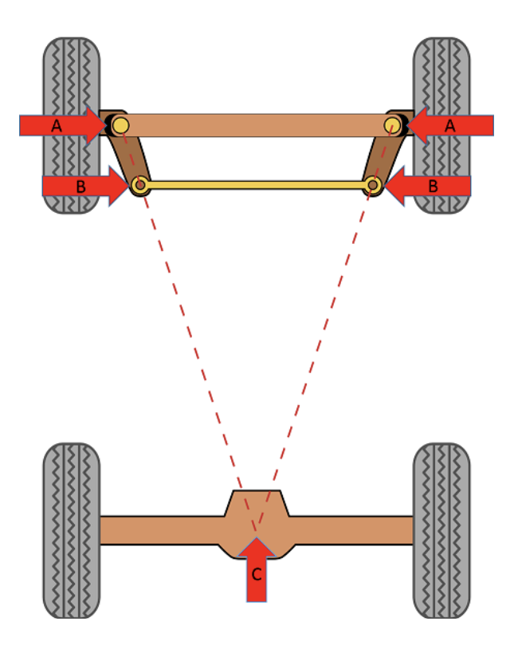<br> <em>Ackermann steering linkage: the tie-rod geometry (A, B) is angled so both front wheels' steering axes converge on a single point (C) on the extended rear axle line.</em> </p>

In our robot:

- A servo motor controls the steering.
- The servo moves a steering linkage connected to both front wheels.
- Carefully designed steering arms create different steering angles for the left and right wheels, following Ackermann geometry.
- The rear wheels provide propulsion through the drive motor, while the front wheels are responsible only for steering.

### The Ackermann Equation

The relationship between the inner steering angle δᵢ and the correct outer steering angle δₒ is a function of two chassis dimensions: the **wheelbase** L (distance between front and rear axles) and the **track width** W (distance between the left and right kingpins/steering pivots). The standard low-speed, pure-rolling condition is expressed as:

```
cot(δₒ) = cot(δᵢ) + W / L
```

This means that for a given inner wheel angle, the correct outer wheel angle is always slightly smaller — using equal angles (parallel steering) instead forces the outer tire to scrub laterally, wasting energy and wearing the tire. For example, on a chassis with a 100 mm wheelbase and 60 mm track width turning the inner wheel to 20°, true Ackermann geometry requires the outer wheel to sit at roughly 16–17°, not 20°.

Geometrically, this condition is equivalent to requiring that a line drawn through each kingpin axis and the outer end of its steering arm, when extended backward, intersects at a single point on the centerline of the rear axle. When that construction holds, both front tires roll about the same turn center without scrubbing at low speed. Real linkages only approximate this condition well within a limited range of steering angles — at very small steering angles (gentle bends), the difference between the inner and outer angle is small enough to be almost negligible, so the benefit of true Ackermann geometry becomes most noticeable in sharper turns, which is exactly the regime our robot operates in when swerving around pillars or taking tight corners on the WRO track.

It is also worth noting that full-size vehicles often intentionally use **less** than 100% Ackermann geometry at speed, because tire slip angles at higher speed reduce the need for the same geometric correction that matters at low, parking-lot speeds. Since our robot operates at comparatively low speeds and small scale, we tuned our steering arms toward closer-to-ideal Ackermann geometry, prioritizing low-slip precision over high-speed compliance.

<p align="center"> 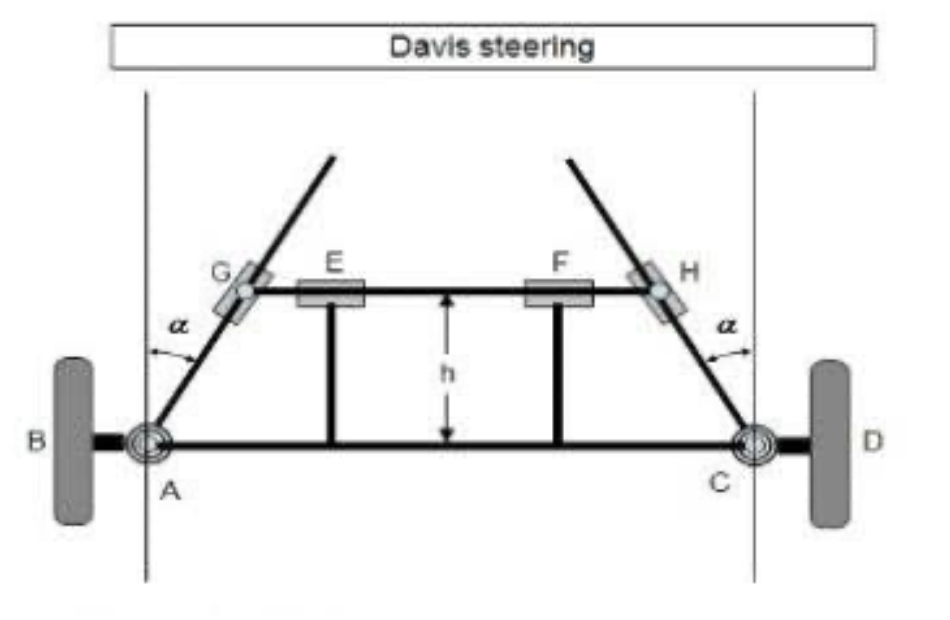<br> <em>Davis steering — the sliding-linkage alternative to Ackermann's four-bar geometry. We evaluated this layout but chose the pivoted trapezoidal (Ackermann) linkage above for lower friction and simpler mounting on the EV3 frame.</em> </p>

### Advantages of Ackermann Steering

- Reduced tire slipping during turns.
- Smaller turning radius, allowing the robot to navigate tight corners.
- Improved path accuracy, especially when following lanes and avoiding obstacles.
- Better vehicle stability at higher speeds.
- Lower mechanical wear because the wheels roll naturally instead of skidding.
- Realistic car-like behavior, making autonomous control algorithms easier to tune and more consistent with real vehicles.

### Why We Chose Ackermann Steering

For the WRO Future Engineers competition, precise steering is essential for lane following, obstacle avoidance, and consistent lap times. Compared to differential drive robots, Ackermann steering produces smoother trajectories, more predictable turning behavior, and improved control at speed. This makes it well suited for autonomous driving challenges where accuracy and repeatability are critical.

### Simplified Steering Diagram

```
        Front

      /         \
 Inner Wheel   Outer Wheel
 (larger angle) (smaller angle)

        \       /
         \     /
   Instantaneous
 Rotation Center

        Rear Drive Wheels
```

This geometry ensures that all four wheels follow circular paths with a common center during a turn, minimizing slip and maximizing steering efficiency.

---

## Servo Motor Integration with the Ackermann Steering Mechanism

The Ackermann steering mechanism in our WRO 2026 Future Engineers robot is actuated by a high-torque servo motor, which provides precise control over the steering angle of the front wheels. Unlike a standard DC motor, a servo motor can rotate to a specific position based on the control signal it receives, making it ideal for accurate steering.

<p align="center"> 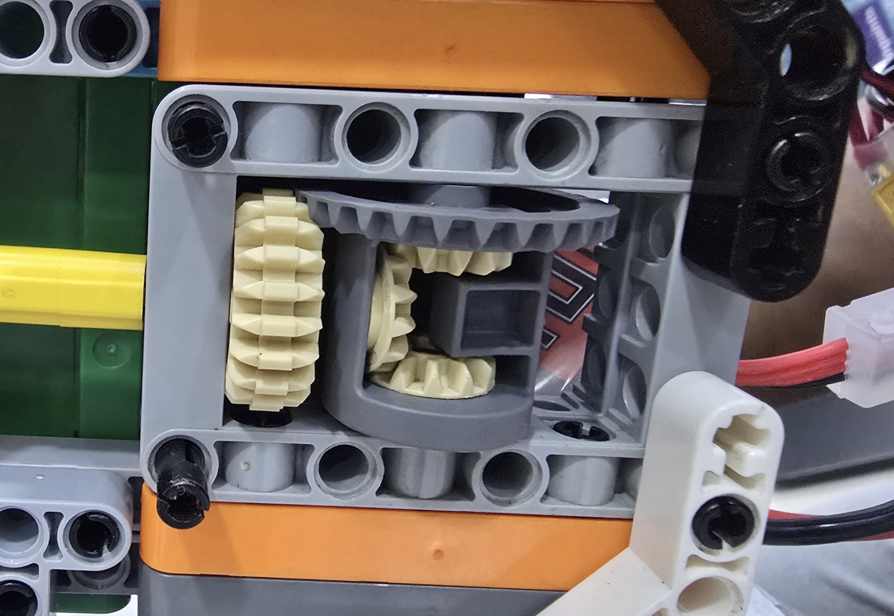<br> <em>The servo gearbox mounted to the chassis, meshing into the steering linkage gear train.</em> </p>

### How the Servo Controls Steering

The servo motor is mounted near the front axle and is connected to the steering linkage through a servo horn and a steering rod. When the autonomous control algorithm determines that the robot must turn, it sends a steering command to the servo. The servo rotates to the required angle, pulling or pushing the steering linkage.

As the linkage moves:

- The left and right steering arms rotate together.
- Due to the Ackermann steering geometry, the inner wheel automatically turns more than the outer wheel.
- The front wheels align with the correct turning radius, allowing the robot to corner smoothly with minimal wheel slip.

Because the servo can move to precise angular positions, the robot can make small steering corrections while driving, improving lane following and obstacle avoidance.

### Advantages of Using a Servo Motor

- High positioning accuracy enables precise steering control.
- Fast response time allows quick adjustments during autonomous navigation.
- Repeatable movement ensures consistent steering performance across multiple runs.
- Compact and lightweight, making it suitable for WRO vehicle designs.
- Easy integration with common robot controllers such as Arduino, Raspberry Pi, and ESP32 using PWM (Pulse Width Modulation).

By combining a servo motor with the Ackermann steering mechanism, our robot achieves smooth, accurate, and reliable steering that closely resembles the behavior of a real automobile. This combination improves navigation performance, increases stability during turns, and helps the robot maintain accurate trajectories throughout the WRO Future Engineers challenge.

---

## Differential Gear System

### Overview

Our WRO 2026 Future Engineers robot uses the LEGO EV3 Differential Gear as part of its drivetrain. The differential is installed between the rear drive wheels and is responsible for distributing power while allowing each wheel to rotate at different speeds during a turn. This mechanism is widely used in real automobiles because it improves handling, reduces mechanical stress, and enables smoother cornering.

### How the Differential Gear Works

A differential consists of a set of bevel gears housed within a differential casing. Power from the drive motor is transmitted to the differential, which then distributes torque to both rear wheels.

When the robot travels in a straight line:

- Both rear wheels rotate at the same speed.
- The internal gears do not rotate relative to one another.
- Power is evenly distributed to both wheels.

When the robot enters a turn:

- The outer wheel must travel a greater distance than the inner wheel.
- The differential allows the outer wheel to rotate faster while the inner wheel rotates more slowly.
- Torque continues to be transmitted to both wheels, allowing the robot to maintain traction throughout the turn.

This ability to accommodate different wheel speeds is essential for smooth and efficient vehicle movement.

### Integration with the Ackermann Steering System

The differential gear works together with the Ackermann steering mechanism to produce realistic vehicle dynamics.

As the servo motor steers the front wheels according to Ackermann geometry, the rear differential automatically compensates for the difference in wheel travel. Since the outer rear wheel follows a larger turning radius, it rotates faster than the inner rear wheel. The differential enables this speed difference without causing wheel slip or excessive mechanical stress.

Together, these two systems allow the robot to corner smoothly while maintaining stability and accurate path tracking.

### Advantages of Using the EV3 Differential

- Allows the rear wheels to rotate at different speeds during turns.
- Reduces tire scrubbing and wheel slip.
- Improves stability and handling while cornering.
- Minimizes stress on the drivetrain and gears.
- Increases the efficiency of power transmission.
- Produces realistic car-like driving behavior, similar to full-sized automobiles.

### Why We Chose the EV3 Differential

The LEGO EV3 Differential Gear is compact, reliable, and easy to integrate with Technic components. It provides a proven mechanical solution that requires no additional programming to compensate for wheel speed differences. By combining the EV3 differential with our Ackermann steering mechanism, the robot achieves smoother turns, better traction, and more predictable autonomous navigation throughout the WRO Future Engineers challenge.

### Simplified Differential Diagram

```
            Drive Motor
                 │
                 ▼
        ┌─────────────────┐
        │  Differential   │
        └─────────────────┘
          │             │
          ▼             ▼
     Left Rear     Right Rear
       Wheel          Wheel

Straight:  Same wheel speed
Turning:   Outer wheel rotates faster than inner wheel
```

---

## Relation with the DC Motor

The differential gear is driven by a DC motor, which provides the power required to propel the robot. The motor transfers rotational motion to the differential, which then distributes torque to both rear wheels. During turns, the differential automatically allows each wheel to rotate at a different speed while the DC motor continues to provide a constant power input, ensuring smooth and efficient movement.

---

## Computer Vision Pipeline & Mathematical Foundations

Our obstacle-detection pipeline identifies red and green pillars from a live camera feed and converts them into steering decisions. Each stage below exists to solve a specific real-world failure mode we observed on the physical track.

### Gray-World White Balance

The Gray-World algorithm assumes that the average reflectance of a natural scene is achromatic (neutral gray). Given an RGB image with color channels C ∈ {R, G, B}, the mean intensity of each channel across N pixels is computed:

<p align="center">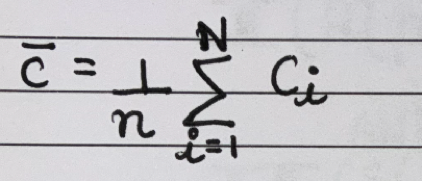</p>

and the target average gray value G_gray is the arithmetic mean of all three channel averages:

<p align="center">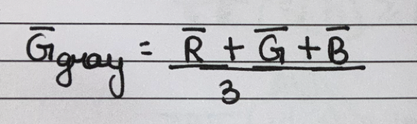</p>

Each pixel intensity value Cᵢ is then scaled by a color-balancing gain factor k_C, where a small constant ε = 10⁻⁶ prevents division by zero under total-darkness conditions:

<p align="center">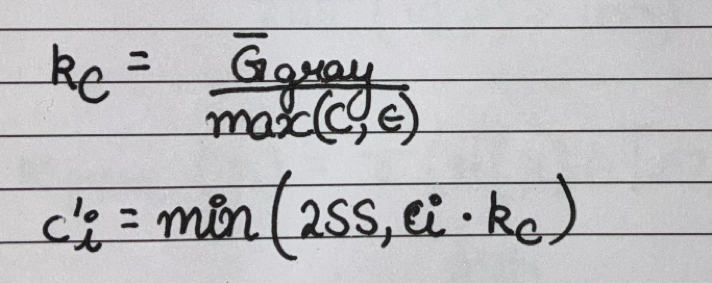</p>

**Engineering Justification:** Ambient lighting in competition venues varies in color temperature (2700K incandescent to 6500K daylight LED). Uncorrected shifts skew the Hue channel in HSV space, causing stationary color thresholds to fail. Normalizing channel means in linear RGB space prior to HSV conversion fixes white balance drift dynamically.

### CLAHE (Contrast Limited Adaptive Histogram Equalization)

Standard Histogram Equalization spreads out intensity frequencies using the Cumulative Distribution Function (CDF) across the entire image. This over-amplifies noise in flat areas.

CLAHE operates locally on M×N contextual sub-regions (tiles), set in code to an 8×8 grid. Within each tile, the histogram is clipped at a normalized clip limit β (in this implementation, `clipLimit = 2.0`):

<p align="center">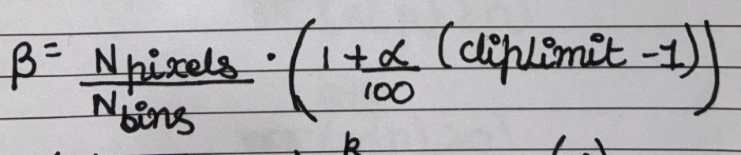</p>

The excess pixels exceeding β are redistributed uniformly across all histogram bins before computing the local CDF transformation:

<p align="center">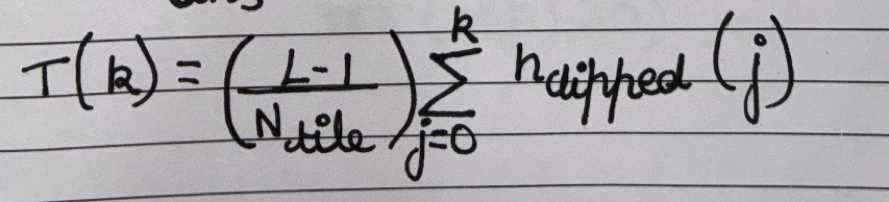</p>

Bilinear interpolation is applied across neighboring tile boundaries to eliminate edge artifacts between blocks.

**Engineering Justification:** Lighting variations create strong directional shadows across the arena floor. Applying CLAHE exclusively to the Value (V) channel in HSV space boosts local shadow details and suppresses bright highlights without altering the underlying chromaticity encoded in the Hue (H) and Saturation (S) channels.

### HSV Hue Topology & Circular Range Thresholding

The Hue coordinate H in HSV space represents an angle on a continuous chromaticity circle where H ∈ [0°, 360°) (scaled to [0, 180) in OpenCV byte representations):

<p align="center">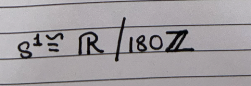</p>

Because pure Red sits at 0° (0 in OpenCV), its color variation wraps around the origin boundary. To catch red regions without false-positive leakage into orange or magenta, the metric thresholding set M_red requires a disjunction of two closed intervals — one near the top of the range and one near the bottom, joined together:

<p align="center">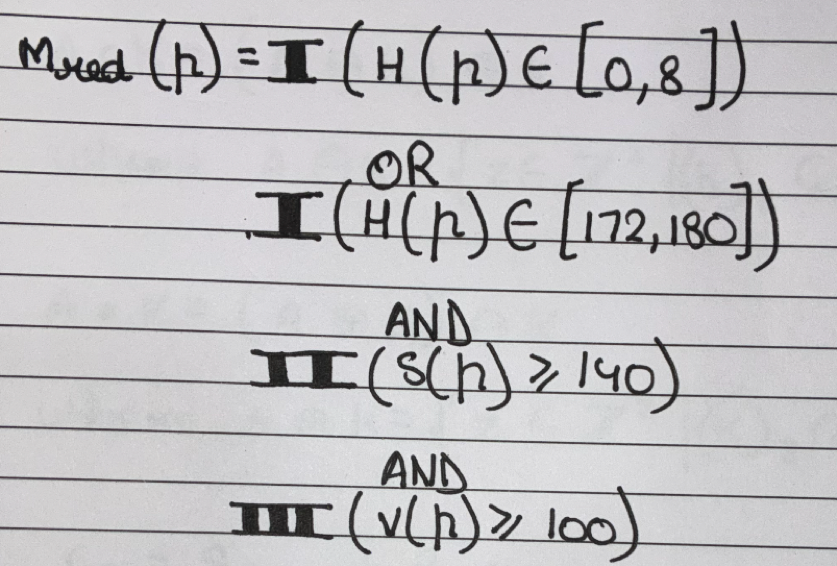</p>

Green sits away from domain boundaries (H ≈ 60° ⇒ 30 in OpenCV), allowing a single convex (contiguous) bound:

<p align="center">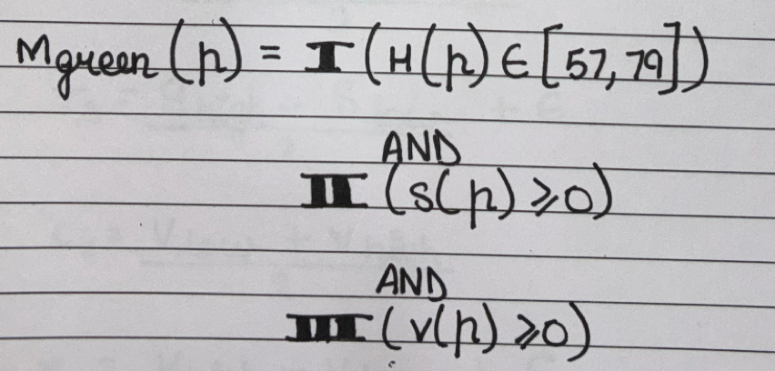</p>

**Engineering Justification:** Failing to account for the continuous, circular (S¹ manifold) structure of Hue forces operators to widen thresholds, introducing false positives from surrounding arena markers. Dual-band splitting isolates pure red across lighting variations without opening the threshold to non-target hues.

### Morphological Operations

Let A ⊂ Z² represent the binary image mask and K ⊂ Z² represent a 5×5 structuring element matrix of ones.

- **Morphological Opening (A ∘ K):** Erosion followed by Dilation. Removes isolated noise pixels smaller than K.

<p align="center">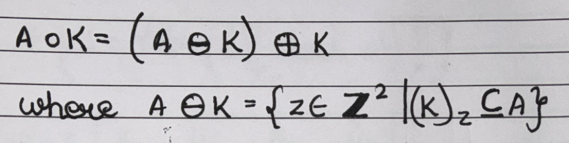</p>

- **Morphological Closing (A ∙ K):** Dilation followed by Erosion. Fills small internal holes within valid detected regions.

<p align="center">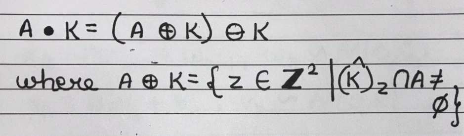</p>

**Engineering Justification:** Single pixels regularly pass color thresholds due to sensor noise, sensor hot-spots, or high-frequency reflections. Morphological opening strips high-frequency impulse noise, while closing welds fragmented blob components into solid contours before geometric evaluation.

### Pillar Geometry Analysis & Composite Confidence Scoring

Contours passing minimum area constraints (A_contour > 150 px) are evaluated on geometric shape and color distributions:

- **Aspect Ratio Metric (S_aspect):** a = w/h, then S_aspect = clip((a − 1.0)/(b − 1.0), 0, 1), where b = 2.0.
- **Solidity Metric (S_solidity):** S_solidity = A_contour / A_hull, where A_hull = Area(ConvexHull(contour)).
- **Color Centrality Score (S_color):** evaluates how closely the mean Saturation and Value within the contour mask match the center of the calibrated color intervals:

<p align="center"> 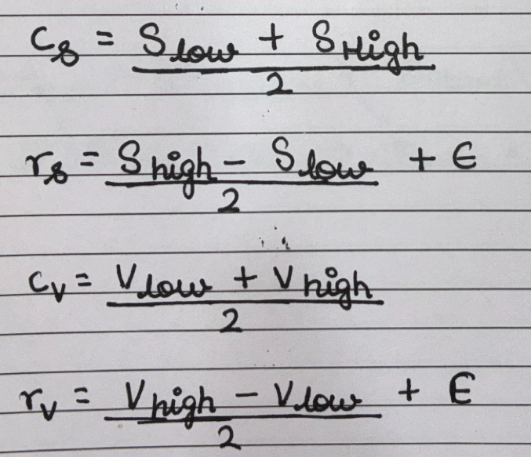 </n><p align="center"> 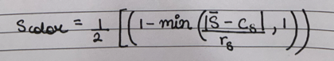 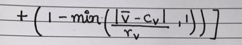</n>

**Composite Score Formula:**

```
Confidence = round(100 × (0.4 · S_solidity + 0.3 · S_aspect + 0.3 · S_color))
```

Any contour scoring below `Min_Confidence = 55%`, or violating hard bounds (w/h < 1.2, Solidity < 0.80), is discarded.

**Engineering Justification:** Simple color thresholding picks up ambient background items with matching colors. Evaluating shape parameters (aspect ratio, convex hull solidity) ensures the visual target matches the known physical dimensions of WRO pillar obstacles before passing targets to the steering logic.

### Filtering & Control Logic

**Discrete Linear Kalman Filter.** The target state vector xₖ ∈ ℝ⁴ captures spatial position and velocity in image coordinates: xₖ = [x, y, ẋ, ẏ]ᵀ. Measurements yield position coordinates directly: zₖ = [zₓ, z_y]ᵀ. The discrete model follows the standard predict/correct form xₖ = F·xₖ₋₁ + wₖ₋₁ (process noise wₖ ~ N(0, Q)) and zₖ = H·xₖ + vₖ (measurement noise vₖ ~ N(0, R)).

**Engineering Justification:** Video frames can drop or experience transient occlusions due to vehicle vibration. The predict-correct cycle maintains state trajectory tracking during missing frames (zₖ = None) while smoothing high-frequency camera vibration jitter during normal tracking.

**Dual-Threshold Hysteresis & Minimum Hold Duration.** To stop steering oscillations near trigger boundaries, decision boundaries use spatial dual-threshold margins combined with minimum temporal hold times:

```
      LEFT TRIGGER (x < 75)      LEFT RELEASE (x > 90)
◄───────────────┼───────────────────────┼──────►
 [TRIGGER RED]  │   HYSTERESIS REGION   │      [CLEAR ZONE]
                │  (Retains RED state)  │
```

Hysteresis control parameters:

|Parameter|Value|
|---|---|
|Left Trigger|x ≤ 90 px|
|Right Trigger|x ≥ 150 px|
|Release Margin|15 px|
|Left Release|x ≤ 75 px|
|Right Release|x ≥ 165 px|
|Minimum Hold Time (t_avoid)|≥ 3.0 s|
|Release Frame Confirmation|6 continuous frames|

State transition logic:

- **Red**, if x_center > 90 and Height ∈ [30, 80]
- **Green**, if x_center < 150 and Height ∈ [30, 80]
- **Reverse**, if Height > 80
- **Clear**, if (t − t_start) ≥ 3.0 s AND position within release bounds AND confirmed for 6 frames

### Serial Interface Protocol

Communication with the ESP32 microcontroller operates over UART at 115200 baud (`/dev/ttyUSB0`). ASCII command lines are terminated with a newline character (`\n`).

|ASCII Command|Event Trigger|Robot Behavior|
|---|---|---|
|`RED\n`|Confirmed red pillar on right|Swerve left to avoid obstacle|
|`GREEN\n`|Confirmed green pillar on left|Swerve right to avoid obstacle|
|`REVERSE\n`|Block height > 80 px|Emergency reverse motion|

---

## ESP32 Maze-Navigating & Self-Stabilizing Subsystem

For maze/wall-following sections of the track, a dedicated ESP32 firmware layer combines absolute orientation sensing with multi-directional distance sensing to hold a straight, drift-free heading and to make reliable turn decisions.

### Technical Overview & Control Architecture

The robot employs a Finite State Machine (FSM) architecture coupled with continuous closed-loop control for dynamic straight-line trajectory holding, wall detection, layout locking, and controlled turn completion.

### Hardware Design & Pin Configuration

- **Microcontroller:** ESP32 (dual-core, 240 MHz)
- **IMU Sensor:** Adafruit BNO055 Absolute Orientation Sensor (multiplexer channel 4)
- **LiDAR Distance Sensors:** 3× TF-Luna I2C LiDAR modules (Left: Ch 0, Center: Ch 1, Right: Ch 2)
- **I2C Multiplexer:** HW-617 / TCA9548A (address 0x70)
- **Steering Servo:** PWM high-torque servo motor (Pin 13)
- **Drive Motors:** DC motor driver with PWM speed control (Pins 25, 26, 33)

|Peripheral|Hardware Pin|Multiplexer Channel|Protocol / Address|
|---|---|---|---|
|I2C SDA|GPIO 21|–|I2C Data|
|I2C SCL|GPIO 22|–|I2C Clock|
|Steering Servo|GPIO 13|–|PWM|
|Left Motor IN1|GPIO 25|–|GPIO Output|
|Left Motor IN2|GPIO 26|–|GPIO Output|
|Motor PWM Pin|GPIO 33|–|PWM Duty Cycle|
|LiDAR Left|–|Channel 0 (MUX_CH_LEFT)|0x10 (I2C)|
|LiDAR Center|–|Channel 1 (MUX_CH_CENTER)|0x10 (I2C)|
|LiDAR Right|–|Channel 2 (MUX_CH_RIGHT)|0x10 (I2C)|
|BNO055 IMU|–|Channel 4 (MUX_CH_BNO)|0x28 (I2C)|
### Circuit / Wiring Diagram

<p align="center">
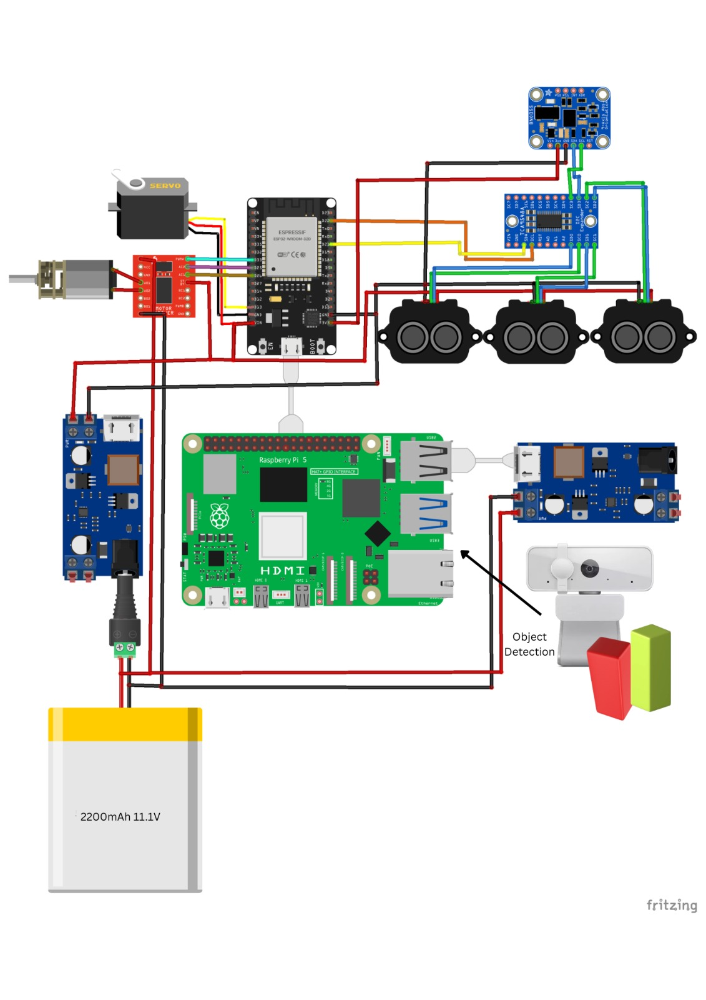<br>
<em>Full wiring schematic: ESP32 core, TCA9548A I2C multiplexer with 3× TF-Luna LiDAR and BNO055 IMU on separate channels, steering servo (GPIO 13), and DC motor driver (GPIO 25/26/33), sharing a common power/ground bus.</em>
</p>

This diagram consolidates the pin table above into a single visual reference, showing the shared I2C bus (SDA/SCL) fanned out through the multiplexer, power distribution from the battery pack to the EV3/ESP32 electronics, and the PWM lines running to the servo and motor driver.
### Engineering Problem Statement & Tuning Workflow Evolution

During testing we ran into a major bottleneck with our firmware upload process, which pushed us through three iterations of the tuning workflow:

**1. The Compilation & Upload Bottleneck.** Every time we changed a single constant in code (like adjusting servo bounds or motor speeds) to test physical responses, compiling and flashing the ESP32 via USB took around a minute. In active physical testing where dozens of small parameters needed rapid trial-and-error adjustment, spending a full minute per upload severely slowed down progress.

**2. The Wi-Fi Overhead & Memory Bloat.** To fix the slow upload cycles, we initially built an embedded Wi-Fi access point and web server (`WebServer.h`) to change variables live via a browser dashboard. However, compiling the full Wi-Fi network stack (`WiFi.h`, `WebServer.h`, `ESPmDNS.h`) alongside the BNO055 IMU, Servo, and Bluetooth drivers made the binary executable extremely large. This memory bloat caused stability issues, random crashes, and sensor communication delays during runs.

**3. The Runtime Bluetooth Command Solution.** To solve both the 1-minute upload delay and the heavy memory footprint of Wi-Fi, we switched our tuning mechanism to Bluetooth Serial (`BluetoothSerial.h`). By sending lightweight key-value text commands over Bluetooth (e.g., `KP=1.2`, `TURN=150`) processed in `handleBluetoothCommands()`, we could update parameters in live RAM instantly without re-flashing the chip or wasting memory on a Wi-Fi server stack. This runtime tuning loop effectively let us have a live conversation with Steve mid-test — change a gain, watch him respond, adjust again — without ever taking him off the table to re-flash.

### Mathematical Foundation & Control Algorithms

**1. Multiplexer Channel Addressing.** To avoid address collision between identical TF-Luna sensors (all defaulting to `0x10`), the TCA9548A multiplexer isolates bus channels using a bitwise shift operation transmitted to multiplexer address `0x70`: `Bitmask = 1 << Channel`. Writing `1 << 0` enables Channel 0, isolating the left LiDAR sensor.

**2. Heading Smoothing & Shortest Angular Distance Algorithm.** _Why it was chosen:_ Magnetometer and gyroscope data exhibit high-frequency jitter and discontinuous phase wrapping at the boundary 0°↔360°. A linear low-pass filter (exponential moving average) breaks down if it averages 1° and 359° directly, producing an incorrect value near 180°.

_Math/Formulation:_ the raw angular delta is first normalized to the range [−180°, 180°] to ensure the filter always transitions across the shortest path:

<p align="center">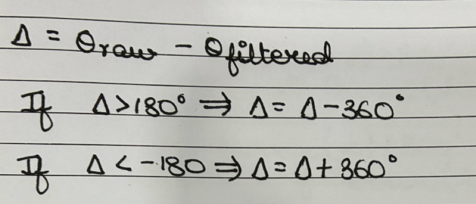</p>

The smoothed heading is then updated via an Exponential Moving Average (EMA) blend with smoothing factor α = 0.2:

<p align="center"></p>

**3. Absolute Orientation Alignment (Cardinal Snapping).** _Why it was chosen:_ In long corridors, accumulating angular drift can cause target headings to degrade (e.g., aiming at 86.4° instead of 90°). The system enforces strict snap-to-cardinal logic to guarantee target vectors remain aligned along orthogonal grid axes (0°, 90°, 180°, 270°).

_Math/Formulation:_ for any target heading θ, the system minimizes absolute angular distance over the cardinal set C = {0°, 90°, 180°, 270°}:

<p align="center">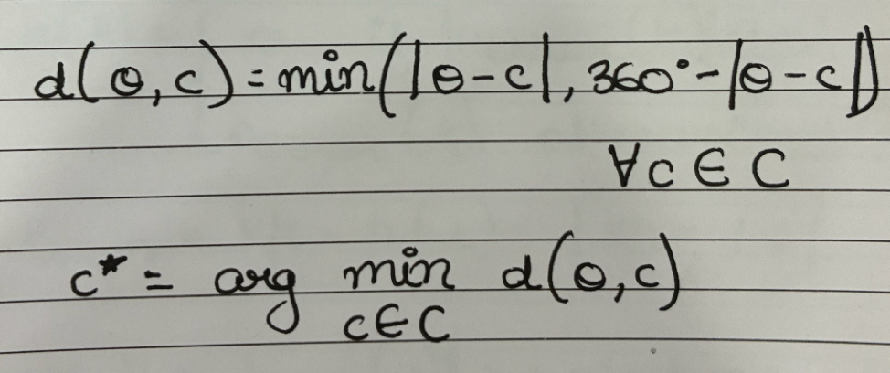</p>

**4. Wall Detection Spike Logic & Layout Locking.** _Why it was chosen:_ Open corridors create sharp delta spikes between left and right LiDAR readings. The robot evaluates this delta to detect dynamic turn opportunities. _Mathematical Condition:_ Δ_dist = dist_left − dist_right.

- If Δ_dist > `SPIKE_THRESHOLD` (100 cm), the left wall has ended → trigger a left turn.
- If Δ_dist < −`SPIKE_THRESHOLD` (−100 cm), the right wall has ended → trigger a right turn.

_Layout Locking:_ upon the first valid turn, `hasTurnedOnce` is flagged true, permanently locking `lockedDirectionLeft`. All subsequent checks bypass opposing wall evaluations, preventing false triggers in complex maze layouts.

**5. Debounced Multi-Sensor Stop Condition.** _Why it was chosen:_ Optical distance readings can suffer from single-frame signal dropouts. The stop condition requires continuous positive detection across all three sensors before confirming a full stop.

_Condition Criteria (all must hold simultaneously):_

- 0 < dist_left < 100 cm
- 0 < dist_right < 100 cm
- 0 < dist_center < 150 cm
- Number of turns ≥ 12

_Temporal Verification:_ the condition must evaluate to true continuously for `timehold ≥ 1000 ms` (`STOP_CONFIRM_MS`). Any interruption resets the timer, eliminating false stops.

The heading error used by the steering PID loop (see below) is computed and wrapped the same way:

<p align="center"> 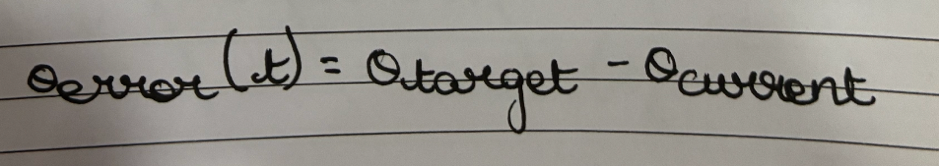</p> <p align="center">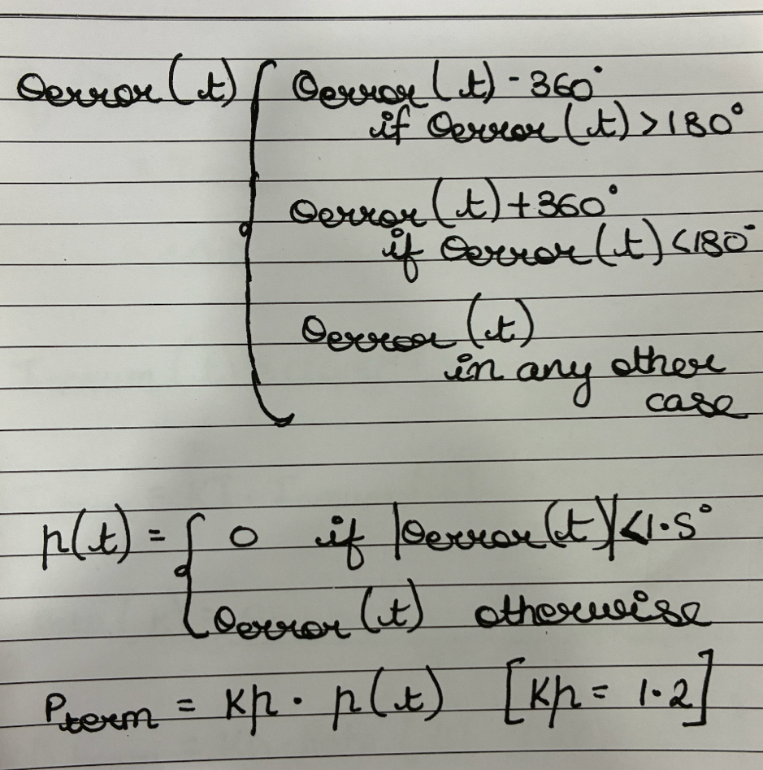</p>

and the accumulated PID terms — integral clamp, derivative rate, and the final command — are formed as:

<p align="center">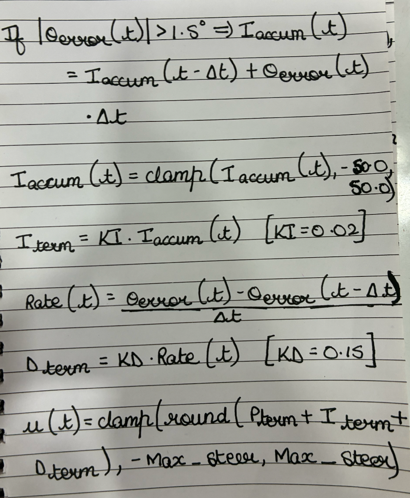</p>

before being mapped onto the physical servo range with a slow-steer ramp near the setpoint and a hard mechanical clamp:

<p align="center">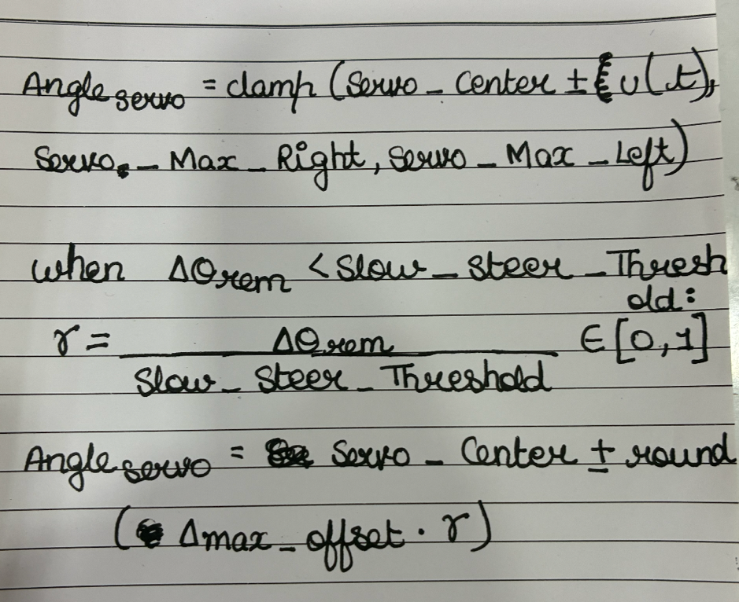</p>

### Bluetooth Serial Calibration Console

Runtime parameters can be configured live over Bluetooth Serial (device name `ESP32_Robot_Telemetry`) without recompiling or re-flashing. **Note: this interface was disabled after tuning/testing was complete**, since a live parameter-override channel is not appropriate to leave active during an official competition run.

Format: `VARIABLE=VALUE` — e.g., `KP=1.5`

|Parameter Command|Variable Name|Description|Default Value|
|---|---|---|---|
|`KP=val`|`STEERING_KP`|Proportional gain constant|1.2|
|`KI=val`|`STEERING_KI`|Integral gain constant|0.02|
|`KD=val`|`STEERING_KD`|Derivative gain constant|0.15|
|`CENTER=val`|`SERVO_CENTER`|Neutral mechanical center angle|70|
|`DIFF=val`|`DIFF`|Max steering offset angle|25|
|`STRAIGHT=val`|`STRAIGHT_SPEED`|Cruise speed PWM (0–255)|150|
|`TURN=val`|`TURN_SPEED`|Turning speed PWM (0–255)|150|

---

## PID Control — Background Theory

Both the vision-based obstacle avoidance and the LiDAR/IMU-based heading holding ultimately drive the same actuator: the Ackermann steering servo. The `STEERING_KP`, `STEERING_KI`, and `STEERING_KD` constants in the calibration table above are the gains of a **PID (Proportional–Integral–Derivative) controller**, one of the most widely used feedback control algorithms in both industrial and hobbyist robotics.

A PID controller continuously computes an _error_ value e(t) — the difference between a desired setpoint (e.g., a target heading of 90°, or a target pillar x-position of 120 px) and the current measured value — and combines three terms to produce a correction:

```
u(t) = Kp·e(t)  +  Ki·∫e(t)dt  +  Kd·(de(t)/dt)
```

- **Proportional (Kp)** — reacts to the current error. A larger Kp produces a stronger immediate steering correction but risks overshoot and oscillation if set too high.
- **Integral (Ki)** — accumulates past error over time, correcting for small persistent biases (for example, a slightly miscalibrated `SERVO_CENTER`) that a purely proportional term would never fully eliminate.
- **Derivative (Kd)** — reacts to the rate of change of the error, damping the response and reducing overshoot as the robot approaches the target heading.

In our system, the error signal fed into the PID loop comes from two different sources depending on which subsystem is active: the horizontal pixel offset of a tracked pillar (Kalman-filtered) during obstacle avoidance, or the shortest-angular-distance heading error (EMA-smoothed) during wall-following. In both cases, the same PID output ultimately maps to a servo pulse-width offset from `SERVO_CENTER`, clipped to the mechanical `DIFF` limit to avoid over-steering the Ackermann linkage past its safe range of travel.

Tuning Kp, Ki, and Kd empirically over Bluetooth Serial (rather than by re-flashing) was the direct motivation for the runtime calibration console described above — it let us observe the robot's physical response to a gain change within seconds instead of a full compile-and-flash cycle.

---

## Glossary

|Term|Meaning|
|---|---|
|**Ackermann steering**|Steering geometry where the inner and outer front wheels turn at different angles so both roll about a common center, avoiding tire scrub.|
|**CLAHE**|Contrast Limited Adaptive Histogram Equalization — a local, noise-controlled contrast enhancement technique.|
|**EMA**|Exponential Moving Average — a recursive low-pass filter weighting recent samples more heavily.|
|**FSM**|Finite State Machine — a control architecture that transitions between a fixed set of discrete states based on inputs.|
|**HSV**|Hue-Saturation-Value color space, often more robust to lighting changes than RGB for color-based detection.|
|**Hysteresis**|A control technique using separate trigger/release thresholds to prevent rapid oscillation near a decision boundary.|
|**IMU**|Inertial Measurement Unit — combines accelerometer, gyroscope, and (often) magnetometer data to estimate orientation.|
|**Kalman filter**|A recursive predict-correct algorithm for estimating a system's state from noisy measurements.|
|**PID controller**|Proportional–Integral–Derivative feedback controller used to drive a measured value toward a setpoint.|
|**PWM**|Pulse Width Modulation — a technique for encoding an analog-like signal (servo angle, motor speed) as a digital pulse train.|
|**UART**|Universal Asynchronous Receiver/Transmitter — a simple serial communication protocol used for the ESP32 command link.|

---

This document consolidates the mechanical, perception, and control subsystem documentation for our WRO 2026 Future Engineers submission — Steve — for use as the primary engineering reference in this repository. He may just be a LEGO chassis with a Kalman filter bolted on, but he corners like he's got somewhere to be.