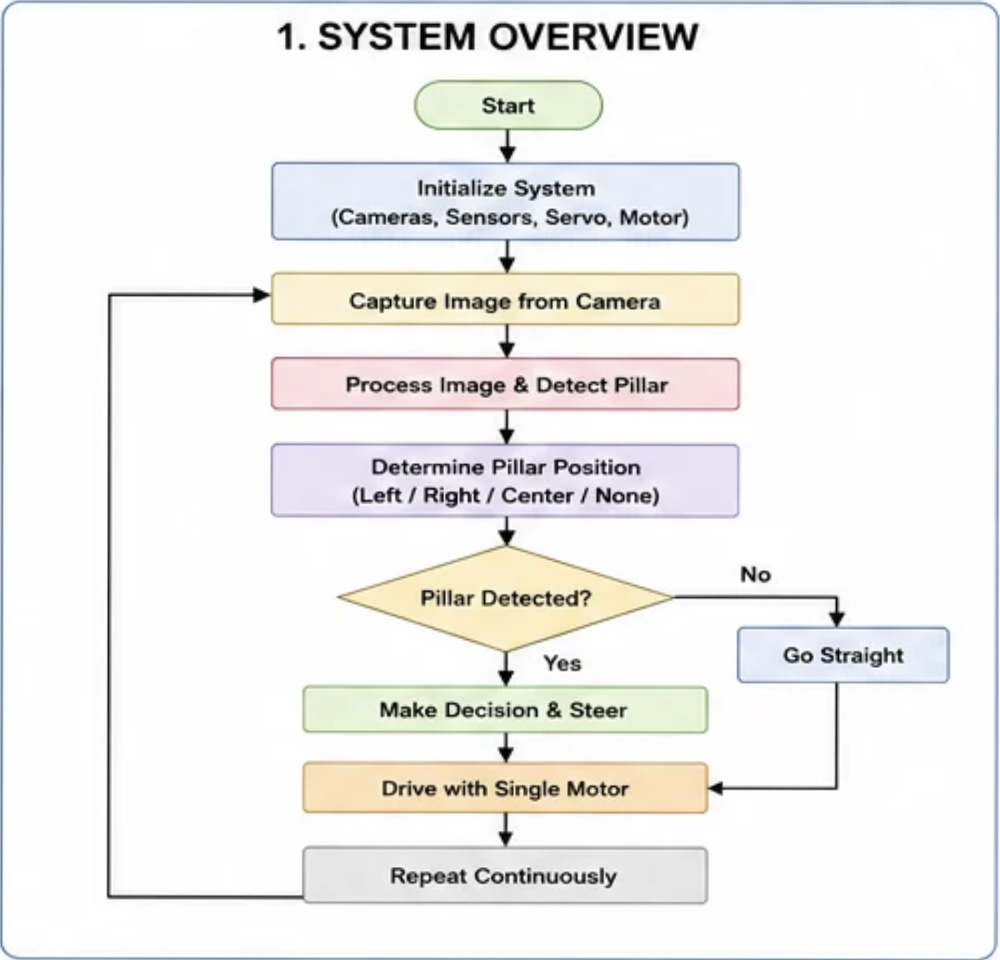
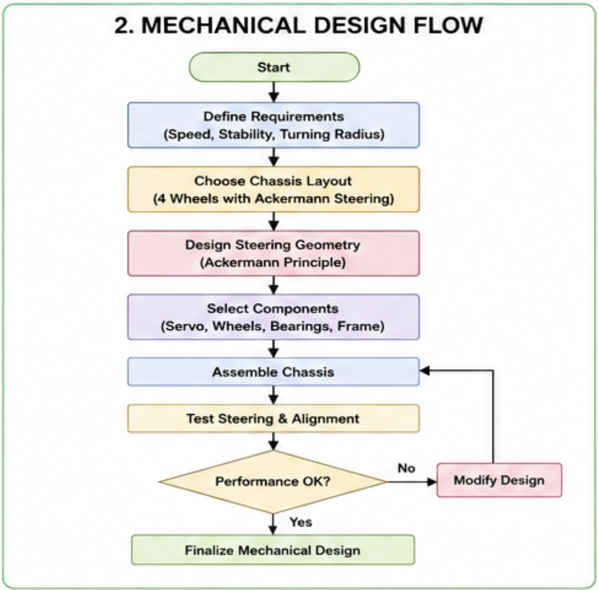
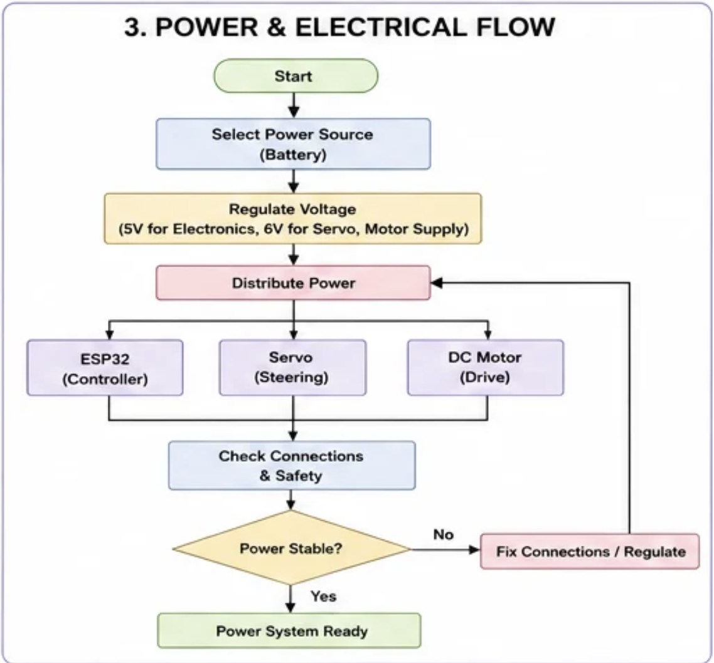

# WRO 2026 Future Engineers — Engineering Documentation

## Table of Contents

1. [Competition Context](#competition-context)
2. [On The Name](#On-The-Name)
3. [System Architecture Overview](#system-architecture-overview)
4. [Chassis and Construction Materials](#chassis-and-construction-materials)
5. [Bill of Materials](#Bill-of-Materials)
6. [Robot at a Glance](#robot-at-a-glance)
7. [Layered Chassis Design](#layered-chassis-design)
8. [Design Evolution](Design-Evolution)
9. [Steering Mechanism — Ackermann Steering](#steering-mechanism--ackermann-steering)
10. [Servo Motor Integration with the Ackermann Steering Mechanism](#servo-motor-integration-with-the-ackermann-steering-mechanism)
11. [Differential Gear System](#differential-gear-system)
12. [Relation with the DC Motor](#relation-with-the-dc-motor)
13. [Power System](Power-System)
14. [Motor Torque & Top Speed: Theoretical vs. Measured](#motor-torque--top-speed-theoretical-vs-measured)
15. [Software Architecture](Software-Architecture)
16. [Getting Started](Getting-Started)
17. [Engineering Decisions](#Engineering-Decisions)
18. [Computer Vision Pipeline & Mathematical Foundations](#computer-vision-pipeline--mathematical-foundations)
19. [ESP32 Maze-Navigating & Self-Stabilizing Subsystem](#esp32-maze-navigating--self-stabilizing-subsystem)
20. [PID Control — Background Theory](#pid-control--background-theory)
21. [Glossary](#glossary)

---

## Competition Context

WRO Future Engineers is the World Robot Olympiad's self-driving car category, aimed at students roughly 14–19 years old. Teams design, build, and program a model vehicle that must complete laps of a track fully autonomously, without any remote control, using whatever combination of controllers, motors, and sensors they choose as long as it fits the general rules. Students design a model car, equip it with electromechanical components, and program it to autonomously drive on a track and avoid obstacles. The category is explicitly built to mirror real self-driving car research, so teams are encouraged to reason about the same engineering trade-offs that full-size autonomous vehicle manufacturers face: steering geometry, sensor fusion, control-loop tuning, and mechanical reliability under repeated real-world testing.

The 2026 season runs two distinct challenge formats, each scored as a timed, single-car run rather than a head-to-head race:

- **Open Challenge** — the vehicle must complete three laps on the track with random placements of the inside track walls, testing pure lane-keeping and heading control without obstacles.
- **Obstacle Challenge** — the vehicle must complete three laps on the track with randomly placed green and red traffic signs, where the signs indicate which side of the lane the vehicle must follow: a red pillar means "keep to the right of the lane" and a green pillar means "keep to the left." Later rounds of the obstacle challenge also require the vehicle to identify a parking space and execute a parallel-parking maneuver to finish the run.

Both challenges are run as **Time Attack** events — only one car is on the track at a time, and each car tries to record the best time driving several fully autonomous laps. Teams are also evaluated on an **Engineering Journal**, which documents design decisions, prototyping iterations, and justifications for chosen components — this repository and its documentation serve that purpose for our team.

Because obstacle placement, wall layout, and (in later rounds) parking-bay location are randomized before each run, the robot cannot rely on a memorized path. This is the core reason our design combines deterministic mechanical geometry (Ackermann steering, a differential drivetrain) with adaptive, sensor-driven control loops (computer vision pillar detection, LiDAR wall-following, IMU heading correction) rather than depending on either alone.

---

## On The Name

We named our robot **Steve**. Not an acronym, not a backronym, not "Self-Tracking Vehicle with Enhanced-something" — just Steve. Somewhere in our design process, between tuning a discrete Kalman filter, wiring a 3-way LiDAR array, and debugging heading drift across a 0°↔360° boundary, we realized the robot deserved a name with the same energy as the engineering was clearly lacking. We wanted something the judges would remember. Turns out nothing is more memorable than a $400 autonomous vehicle named after someone's uncle. So Steve it is — and frankly, given how confidently he snaps to cardinal headings and swerves around pillars, he's earned it

---

## System Architecture Overview

<p align="center"> <br> <em>High-level operating loop: from sensor initialization through continuous drive decisions, tying together the three architecture layers described above.</em> </p>

Our platform is best understood as three cooperating layers:

1. **Mechanical layer** — a LEGO EV3 Technic chassis with Ackermann front steering, a rear differential, and custom 3D-printed sensor/actuator mounts. This layer guarantees that whatever heading and speed commands the software issues get translated into smooth, low-slip motion.
2. **Perception layer** — a camera-based YOLO object detector (ONNX Runtime, CPU inference on the Raspberry Pi 5) for identifying red/green pillars, paired with a 3-way TF-Luna LiDAR array and a BNO055 absolute orientation sensor for wall-following, turn-triggering, and heading stabilization.
3. **Control layer** — a temporal-vote confirmation scheme for stable detections, a one-time waypoint/arc geometry calculation for routing around confirmed obstacles, a PID heading-hold controller for straight-line driving, and a UART/serial link that turns high-level decisions (`CLEAR`, `STOP`, `WAYPOINT`, `REVERSE`) into low-level servo and motor commands.

The sections below document each layer in the depth captured in our design notes, plus supporting engineering background.

---

## Chassis and Construction Materials

Our WRO 2026 Future Engineers robot is built using a combination of LEGO EV3 Technic components and custom-designed 3D-printed parts. This hybrid approach allows us to take advantage of the strength and precision of EV3 while incorporating custom mounts for electronic components that cannot be accommodated using standard LEGO parts.

<p align="center"> <br> <em>The LEGO Mindstorms EV3 Core Set — the base kit our Technic chassis, beams, and gearing are built from.</em> </p>

The main chassis is constructed from LEGO EV3 Technic beams, frames, gears, and connectors. These components are specifically designed for mechanical applications and provide excellent structural rigidity while remaining lightweight. Their standardized dimensions ensure accurate alignment of axles, gears, and bearings, resulting in smooth power transmission and reliable mechanical performance. Additionally, the modular nature of the EV3 system allows the robot to be assembled, modified, and repaired quickly, which proved especially valuable during testing and iterative design improvements.

Compared to a fully 3D-printed chassis, the EV3 structure offers several advantages. Although 3D printing provides greater design freedom, large printed frames are generally more susceptible to layer separation, slight dimensional inaccuracies, and deformation under continuous mechanical loads. These issues can affect gear alignment and steering accuracy over time. In contrast, EV3 components are manufactured with high precision and consistent tolerances, ensuring stronger connections, improved durability, and smoother operation of moving mechanical parts. Their proven reliability makes them particularly suitable for a competition robot that must perform consistently over multiple runs.

While EV3 forms the foundation of our robot, several custom 3D-printed components were designed to integrate modern sensors and actuators that cannot be mounted efficiently using LEGO elements alone. These custom parts include:

- **LiDAR mount** — positions the sensor securely and provides an unobstructed 360° field of view for environmental scanning.
- **Camera mount** — placed at an optimized height and angle to maximize the accuracy of lane detection, obstacle recognition, and computer vision algorithms.
- **DC motor mount** — provides a rigid connection between the motor and drivetrain to minimize unwanted movement and improve power transmission efficiency.
- **Servo motor mount** — plays a critical role in the Ackermann steering system by maintaining precise alignment between the servo horn and steering linkage. A rigid and accurately positioned mount ensures consistent steering angles and reduces mechanical play, directly improving the robot's steering precision.

By combining the mechanical reliability of the LEGO EV3 platform with the flexibility of custom 3D-printed components, our robot benefits from both standardized engineering and application-specific customization. This hybrid design improves structural strength, simplifies maintenance, and enables seamless integration of advanced sensors and actuators, resulting in a robust and competition-ready autonomous vehicle.

---

## Bill of Materials

### Mechanical / LEGO Technic Components

Generated from our Stud.io CAD model export — 151 total pieces, ~214g.

| Part #    | Part Name                                          |                  Color |         Qty | Weight (g, ea) | Source  | Cost (per pc) | Cost (total) |
| --------- | -------------------------------------------------- | ---------------------: | ----------: | -------------: | ------- | ------------: | -----------: |
| 62821b    | Technic Gear Differential 28T Bevel, Closed Center |       Dark Bluish Gray |           1 |              — | EV3 Kit |         $2.50 |        $2.50 |
| 6589      | Technic Gear 12 Tooth Bevel                        |                    Tan |           3 |           0.29 | EV3 Kit |         $0.35 |        $1.05 |
| 41897     | Tire 56 x 28 ZR Street                             |                  Black |           2 |          13.98 | EV3 Kit |         $0.70 |        $1.40 |
| 89201     | Tire 24 x 14 Shallow Tread                         |                  Black |           2 |           2.55 | EV3 Kit |         $0.30 |        $0.60 |
| 56908     | Rim 43.2mm D. x 26mm Technic Racing Small          |                   Gray |           2 |            9.0 | EV3 Kit |         $0.60 |        $1.20 |
| 55982     | Rim 18mm D. x 14mm w/ Axle Hole                    |                   Gray |           2 |           1.75 | EV3 Kit |         $0.25 |        $0.50 |
| 64179     | Technic Liftarm Frame Thick 5x7 Open Center        |      Light Bluish Gray |           3 |            5.3 | EV3 Kit |         $0.60 |        $1.80 |
| 64782     | Technic Panel Plate 5 x 11 x 1                     |                 Orange |           4 |            8.8 | EV3 Kit |         $0.80 |        $3.20 |
| 41239     | Technic Liftarm Thick 1x13                         |      Light Bluish Gray |           7 |            3.3 | EV3 Kit |         $0.40 |        $2.80 |
| 32525     | Technic Liftarm Thick 1x11                         |      Light Bluish Gray |           6 |            2.8 | EV3 Kit |         $0.35 |        $2.10 |
| 32524     | Technic Liftarm Thick 1x7                          |      Light Bluish Gray |           6 |           1.74 | EV3 Kit |         $0.25 |        $1.50 |
| 40490     | Technic Liftarm Thick 1x9                          |      Light Bluish Gray |           4 |           2.59 | EV3 Kit |         $0.30 |        $1.20 |
| 60484     | Technic Liftarm Modified T-Shape Thick 3x3         |                  Black |           5 |           1.19 | EV3 Kit |         $0.25 |        $1.25 |
| 32526     | Technic Liftarm Modified Bent L-Shape 3x5          | White / Lt Bluish Gray |       2 + 4 |           1.77 | EV3 Kit |         $0.30 |        $1.80 |
| 32140     | Technic Liftarm Modified Bent L-Shape 2x4          |      Light Bluish Gray |           2 |           1.43 | EV3 Kit |         $0.25 |        $0.50 |
| 32316     | Technic Liftarm Thick 1x5                          |      Light Bluish Gray |           2 |           1.21 | EV3 Kit |         $0.20 |        $0.40 |
| 43857     | Technic Liftarm Thick 1x2                          |      Light Bluish Gray |           4 |            0.4 | EV3 Kit |         $0.15 |        $0.60 |
| 48989     | Technic Pin Connector Perpendicular 3L w/ 4 Pins   |      Light Bluish Gray |           2 |           1.22 | EV3 Kit |         $0.30 |        $0.60 |
| 44809     | Technic Pin Connector Perpendicular 2x2 Bent       |                    Red |           2 |            0.5 | EV3 Kit |         $0.25 |        $0.50 |
| 6558      | Technic Pin 3L with Friction Ridges                |                   Blue |          19 |           0.31 | EV3 Kit |         $0.15 |        $2.85 |
| 2780      | Technic Pin with Short Friction Ridges             |                  Black |          55 |           0.16 | EV3 Kit |         $0.10 |        $5.50 |
| 15100     | Technic Pin with Friction Ridges and Pin Hole      |                  Black |           2 |            0.4 | EV3 Kit |         $0.15 |        $0.30 |
| 3713      | Technic Bush                                       |      Light Bluish Gray |           4 |           0.14 | EV3 Kit |         $0.10 |        $0.40 |
| 4265c     | Technic Bush 1/2 Smooth                            |                 Yellow |           2 |            0.1 | EV3 Kit |         $0.10 |        $0.20 |
| 3737      | Technic Axle 10L                                   |                  Black |           2 |           1.49 | EV3 Kit |         $0.30 |        $0.60 |
| 3749      | Technic Axle 1L with Pin, no friction ridges       |                    Tan |           2 |           0.22 | EV3 Kit |         $0.15 |        $0.30 |
| **Total** |                                                    |                        | **151 pcs** |     **~214 g** |         |               |   **$31.75** |

### Electronics / Control

|Component|Model / Part #|Qty|Purpose|Source|Cost (approx.)|
|---|---|--:|---|---|--:|
|Microcontroller|ESP32-WROOM-32 DevKit (dual-core, 240 MHz)|1|Low-level control, FSM, PID steering|Amazon|$9|
|Vision compute|Raspberry Pi 5, 8GB|1|Camera capture + CV pipeline|raspberrypi.com|$85|
|IMU|Adafruit BNO055 Absolute Orientation Sensor (Product ID 2472)|1|Heading hold, cardinal snapping|adafruit.com|$34.95|
|LiDAR|Benewake TF-Luna I2C/UART ToF LiDAR|3|Left/Center/Right wall-following|DFRobot|$90 for all 3|
|I2C Multiplexer|Adafruit TCA9548A (Product ID 2717)|1|Channel-isolate identical-address LiDARs + IMU|adafruit.com|$6.95|
|Steering actuator|TowerPro SG90 micro servo (9g, ~1.8 kg·cm torque)|1|Ackermann steering actuation|Amazon|$4|
|Drive motor|GA12-N20, 12V, 600 RPM metal gear motor|1|Propulsion via differential|Amazon|$6|
|Motor driver|PWM DC motor driver(tb6612fng)|1|Speed control for N20 motor|Amazon|$5|
|Camera|Lenovo 300 FHD Webcam (USB, 1080p/2.1MP CMOS, 95° lens, 4x digital zoom, 360° rotation, dual mics)|1|Pillar color/shape detection|Amazon|$25|
|Battery|11.1V, 3S, 60C, LiPo, 2200 mAh|1|Power source|Amazon|$15|

### 3D-Printed Custom Parts

|Part|Purpose|Qty|Print material/cost basis|Cost|
|---|---|--:|---|--:|
|LiDAR mount|Secure 360° FOV positioning|1|In-house 3D print|$1|
|Camera mount|Optimized height/angle for CV|1|In-house 3D print|$1|
|DC motor mount|Rigid drivetrain connection|1|In-house 3D print|$1|
|Servo mount|Precise Ackermann linkage alignment|1|In-house 3D print|$1|
|**3D-printed subtotal**||**4**||**$4**|

_LEGO parts list generated from our Stud.io CAD model export (see `CAD-Files/`)._

---

## Robot at a Glance

|Spec|Value|
|---|---|
|Total weight|870 g|
|Length (frontmost to rearmost)|175 mm|
|Height (with camera)|190 mm|
|Height (without camera)|170 mm|
|Wheelbase (front axle to rear axle)|90 mm|
|Front track width (inner edge / outer edge)|91.5 mm / 117 mm|
|Rear track width (inner edge / outer edge)|130.22 mm / 165 mm|
|Ground clearance (front)|3 mm|
|Ground clearance (rear)|15 mm|

**Note on ground clearance:** Steve's ground clearance is meaningfully lower at the front (3mm) than the rear (15mm). This asymmetry is a natural consequence of the layered chassis design (see "Layered Chassis Design"), where heavier components (battery, Raspberry Pi) sit low and toward the rear/center to lower the robot's center of gravity — the front, carrying only the lighter steering assembly, sits closer to the ground. The very low front clearance (3mm) is worth flagging as a practical consideration: it leaves little margin for uneven track surfaces or debris under the front steering assembly before contact risk becomes a factor.

---

## Layered Chassis Design

A key design objective for our robot was to achieve a compact, well-balanced, and mechanically robust structure. To accomplish this, we adopted a layered chassis design using LEGO EV3 Technic beams and LEGO Technic panel plates. This approach allowed us to separate the robot into multiple functional levels while maintaining a rigid and modular frame.

The upper layer houses the electronic circuit and wiring, making them easily accessible for maintenance and reducing cable interference with the drivetrain and steering components. The lower layer accommodates heavier components, including the Raspberry Pi and the battery pack. Positioning these components closer to the ground lowers the robot's center of gravity, improving overall stability.

A lower center of gravity significantly enhances the robot's performance during high-speed maneuvers. As the robot enters a corner, weight transfer is reduced, minimizing body roll and helping all four wheels maintain better contact with the ground. This increases the effective downward force acting on the wheels, resulting in improved tire grip and allowing the robot to take corners at higher speeds while maintaining accurate control. The balanced weight distribution also contributes to smoother steering response and reduces the likelihood of tipping or instability during rapid direction changes.

The layered construction was made possible using LEGO Technic panel plates, which serve as sturdy platforms between the chassis levels. These panels are securely supported by various LEGO EV3 Technic beams and connectors, creating a lightweight yet rigid structure capable of withstanding repeated testing and competition conditions.

By organizing the robot into dedicated layers, we achieved a clean mechanical layout, simplified maintenance, improved protection for electronic components, and enhanced driving performance through a lower center of gravity and more stable weight distribution.

---

## Design Evolution

<p align="center"> <br> <em>General mechanical design process followed for Steve's chassis and steering — each entry below documents a specific problem encountered and fix made within this process.</em> </p>

### Steering Linkage: Play at the Joints

**Problem:** The steering linkage had play at the joints, leading to inconsistent steering angles between identical commanded positions.

**Modification:** We redesigned the servo linkage.

**Result:** We verified the fix by repeatedly commanding the servo between 0° and 90° (0 → 90 → 0 → 90...) and measuring the actual wheel angle at each step by hand, noting any inconsistencies between repeated commands to the same angle.

---

### Steering Mount: 3D-Printed Part Redesign

**Problem:** An earlier 3D-printed steering mount part was weakly secured to the chassis, using pivot-style attachment points that didn't hold firmly under repeated steering loads.

**Modification:** We reprinted the part at a denser infill for greater structural strength, and switched the attachment method from pivots to screws for a rigid, fixed connection to the chassis.

**Result:** The part now holds securely under repeated steering loads, with no further loosening at the mounting point.

---

### Drive Motor: N20 Mount Redesign

**Problem:** Our first mount for the N20 drive motor was not structurally sound and broke off from the chassis under normal operation.

**Modification:** We redesigned the motor mount for a more rigid, secure connection to the chassis.

**Result:** No further mount failures after the redesign.

---

### Drive Motor: Upgrading from 200 RPM to 600 RPM

**Problem:** Our original N20 motor was rated at 200 RPM. At full drive signal (255 PWM), this motor only completed our test lap distance in 12 seconds — too slow for competitive lap times.

**Modification:** We switched to a GA12-N20, 12V, 600 RPM motor, giving substantially higher output speed at the same 255 PWM drive signal.

**Result:** With the 600 RPM motor, our bot completed one round, in around 9.8 seconds, significantly faster, gaining around 3.5 seconds across 3 laps.

---

### Computer Vision: HSV Threshold Recalibration Tooling _(historical — pipeline since replaced)_

**Problem:** Our color-detection pipeline relies on fixed HSV threshold bounds to isolate red and green pillars. Thresholds tuned under one lighting condition do not necessarily hold under a different one, since ambient lighting shifts the same pillar's Hue/Saturation/Value readings.

**Modification:** We built a dedicated tool to retune HSV threshold values directly, letting us recalibrate quickly instead of hand-editing constants in code for every lighting condition. The tool is available in this repository at [`src/vision/scripts/hsvcali.py`]

**Result:** When moving from Orange to White lighting, earlier we had to take around 20 photos of the pillars, and get the mean rgb values, which took around 30 minutes, but now with this tool, using OpenCV, we can do it much quicker, in under 5 minutes.

**Note:** This HSV-threshold pipeline and its recalibration tool have since been retired in favor of a trained YOLO object detector (see "Computer Vision Pipeline & Mathematical Foundations"). This entry is kept as a record of the design's history.

---

### Sensors: LiDAR I2C Address Conflict

**Problem:** All three TF-Luna LiDAR units share the same default I2C address (`0x10`). Wiring them directly onto the ESP32's I2C bus caused an address conflict, since the microcontroller couldn't distinguish which sensor it was communicating with.

**Modification:** We added a TCA9548A I2C multiplexer between the ESP32 and the three LiDAR units, assigning each sensor to its own multiplexer channel (Left: Ch 0, Center: Ch 1, Right: Ch 2).

**Result:** Fully resolved the address collision — all three LiDAR units now operate independently and reliably on a single I2C bus.

---

## Steering Mechanism — Ackermann Steering

### Overview

Our WRO 2026 Future Engineers robot uses an Ackermann steering mechanism, which closely replicates the steering geometry used in real passenger cars. This design allows the robot to turn smoothly while maintaining stability and reducing tire friction. Since the WRO Future Engineers challenge focuses on autonomous self-driving vehicles, Ackermann steering provides realistic vehicle dynamics and improves navigation accuracy.

### How Ackermann Steering Works

When a vehicle turns, the inner front wheel follows a smaller turning radius than the outer front wheel. Therefore, both wheels cannot be steered by the same angle.

The Ackermann steering mechanism solves this by ensuring:

- The inner wheel turns at a larger angle.
- The outer wheel turns at a smaller angle.
- Both wheels point toward the same instantaneous center of rotation, allowing the vehicle to roll through the corner without unnecessary wheel slip.

<p align="center"> <br> <em>Ackermann steering linkage: the tie-rod geometry (A, B) is angled so both front wheels' steering axes converge on a single point (C) on the extended rear axle line.</em> </p>

In our robot:

- A servo motor controls the steering.
- The servo moves a steering linkage connected to both front wheels.
- Carefully designed steering arms create different steering angles for the left and right wheels, following Ackermann geometry.
- The rear wheels provide propulsion through the drive motor, while the front wheels are responsible only for steering.

### The Ackermann Equation

The relationship between the inner steering angle δᵢ and the correct outer steering angle δₒ is a function of two chassis dimensions: the **wheelbase** L (distance between front and rear axles) and the **track width** W (distance between the left and right kingpins/steering pivots). The standard low-speed, pure-rolling condition is expressed as:

```
cot(δₒ) = cot(δᵢ) + W / L
```

This means that for a given inner wheel angle, the correct outer wheel angle is always slightly smaller — using equal angles (parallel steering) instead forces the outer tire to scrub laterally, wasting energy and wearing the tire. On Steve's actual chassis — a 90mm wheelbase (L) and 104.25mm front track width (W, averaged from center-to-center inner/outer wheel measurements) — commanding the inner wheel to Steve's actual maximum steering angle of 14.5° (the firmware commands the servo to its `DIFF = 25°` limit, but the steering linkage's mechanical leverage ratio means the front wheels themselves only deviate 14.5° at that command — see "Servo Motor Integration" for the linkage) requires the outer wheel to sit at approximately 12.0°, not 14.5°, for true Ackermann geometry to hold.

Geometrically, this condition is equivalent to requiring that a line drawn through each kingpin axis and the outer end of its steering arm, when extended backward, intersects at a single point on the centerline of the rear axle. When that construction holds, both front tires roll about the same turn center without scrubbing at low speed. Real linkages only approximate this condition well within a limited range of steering angles — at very small steering angles (gentle bends), the difference between the inner and outer angle is small enough to be almost negligible, so the benefit of true Ackermann geometry becomes most noticeable in sharper turns, which is exactly the regime our robot operates in when swerving around pillars or taking tight corners on the WRO track.

It is also worth noting that full-size vehicles often intentionally use **less** than 100% Ackermann geometry at speed, because tire slip angles at higher speed reduce the need for the same geometric correction that matters at low, parking-lot speeds. Since our robot operates at comparatively low speeds and small scale, we tuned our steering arms toward closer-to-ideal Ackermann geometry, prioritizing low-slip precision over high-speed compliance.

<p align="center"> <br> <em>Davis steering — the sliding-linkage alternative to Ackermann's four-bar geometry. We evaluated this layout but chose the pivoted trapezoidal (Ackermann) linkage above for lower friction and simpler mounting on the EV3 frame.</em> </p>

### Turning Radius Calculation

Using the bicycle-model approximation, with wheelbase L = 90mm and Steve's actual maximum front wheel steering angle δ = 14.5° (measured at the wheel — not the 25° commanded at the servo; see note below):

```
R = L / tan(δ)
  = 90mm / tan(14.5°)
  = 90mm / 0.2586
  ≈ 348.0 mm
```

This gives Steve's approximate minimum turning radius — roughly 348mm (about 34.8 cm) — the tightest circle the robot can complete at maximum steering lock, measured from the center of the rear axle to the instantaneous center of rotation.

**Note on servo angle vs. wheel angle:** The firmware's `DIFF = 25°` (see Bluetooth Serial Calibration Console) is the maximum angle commanded at the _servo horn_, not the actual front wheel angle. Steve's steering linkage has a mechanical leverage ratio that reduces this to a measured 14.5° at the wheels themselves — using the uncorrected 25° figure in this calculation would have overstated Steve's actual turning ability by a significant margin (a naive calculation using 25° would suggest a ~193mm radius, nearly half the real value). This is a good example of why measuring the real mechanical output, rather than trusting the commanded input value, matters for an accurate spec.

**⚠️ Simplification noted:** This is a single-track (bicycle model) approximation, treating the front axle as one steered wheel at the average Ackermann angle rather than separately modeling the inner and outer wheels' slightly different angles (12.0° vs. 14.5°, per the Ackermann Equation above). A more precise geometric calculation would use the inner wheel's actual turning circle directly, which would give a very slightly tighter radius than this approximation.

### Advantages of Ackermann Steering

- Reduced tire slipping during turns.
- Smaller turning radius, allowing the robot to navigate tight corners.
- Improved path accuracy, especially when following lanes and avoiding obstacles.
- Better vehicle stability at higher speeds.
- Lower mechanical wear because the wheels roll naturally instead of skidding.
- Realistic car-like behavior, making autonomous control algorithms easier to tune and more consistent with real vehicles.

### Why We Chose Ackermann Steering

For the WRO Future Engineers competition, precise steering is essential for lane following, obstacle avoidance, and consistent lap times. Compared to differential drive robots, Ackermann steering produces smoother trajectories, more predictable turning behavior, and improved control at speed. This makes it well suited for autonomous driving challenges where accuracy and repeatability are critical.

### Simplified Steering Diagram

```
        Front

      /         \
 Inner Wheel   Outer Wheel
 (larger angle) (smaller angle)

        \       /
         \     /
   Instantaneous
 Rotation Center

        Rear Drive Wheels
```

This geometry ensures that all four wheels follow circular paths with a common center during a turn, minimizing slip and maximizing steering efficiency.

---

## Servo Motor Integration with the Ackermann Steering Mechanism

The Ackermann steering mechanism in our WRO 2026 Future Engineers robot is actuated by a high-torque servo motor, which provides precise control over the steering angle of the front wheels. Unlike a standard DC motor, a servo motor can rotate to a specific position based on the control signal it receives, making it ideal for accurate steering.

<p align="center"> <br> <em>The servo gearbox mounted to the chassis, meshing into the steering linkage gear train.</em> </p>

### How the Servo Controls Steering

The servo motor is mounted near the front axle and is connected to the steering linkage through a servo horn and a steering rod. When the autonomous control algorithm determines that the robot must turn, it sends a steering command to the servo. The servo rotates to the required angle, pulling or pushing the steering linkage.

As the linkage moves:

- The left and right steering arms rotate together.
- Due to the Ackermann steering geometry, the inner wheel automatically turns more than the outer wheel.
- The front wheels align with the correct turning radius, allowing the robot to corner smoothly with minimal wheel slip.

Because the servo can move to precise angular positions, the robot can make small steering corrections while driving, improving lane following and obstacle avoidance.

### Advantages of Using a Servo Motor

- High positioning accuracy enables precise steering control.
- Fast response time allows quick adjustments during autonomous navigation.
- Repeatable movement ensures consistent steering performance across multiple runs.
- Compact and lightweight, making it suitable for WRO vehicle designs.
- Easy integration with common robot controllers such as Arduino, Raspberry Pi, and ESP32 using PWM (Pulse Width Modulation).

By combining a servo motor with the Ackermann steering mechanism, our robot achieves smooth, accurate, and reliable steering that closely resembles the behavior of a real automobile. This combination improves navigation performance, increases stability during turns, and helps the robot maintain accurate trajectories throughout the WRO Future Engineers challenge.

---

## Differential Gear System

### Overview

Our WRO 2026 Future Engineers robot uses the LEGO EV3 Differential Gear as part of its drivetrain. The differential is installed between the rear drive wheels and is responsible for distributing power while allowing each wheel to rotate at different speeds during a turn. This mechanism is widely used in real automobiles because it improves handling, reduces mechanical stress, and enables smoother cornering.

### How the Differential Gear Works

A differential consists of a set of bevel gears housed within a differential casing. Power from the drive motor is transmitted to the differential, which then distributes torque to both rear wheels.

When the robot travels in a straight line:

- Both rear wheels rotate at the same speed.
- The internal gears do not rotate relative to one another.
- Power is evenly distributed to both wheels.

When the robot enters a turn:

- The outer wheel must travel a greater distance than the inner wheel.
- The differential allows the outer wheel to rotate faster while the inner wheel rotates more slowly.
- Torque continues to be transmitted to both wheels, allowing the robot to maintain traction throughout the turn.

This ability to accommodate different wheel speeds is essential for smooth and efficient vehicle movement.

### Integration with the Ackermann Steering System

The differential gear works together with the Ackermann steering mechanism to produce realistic vehicle dynamics.

As the servo motor steers the front wheels according to Ackermann geometry, the rear differential automatically compensates for the difference in wheel travel. Since the outer rear wheel follows a larger turning radius, it rotates faster than the inner rear wheel. The differential enables this speed difference without causing wheel slip or excessive mechanical stress.

Together, these two systems allow the robot to corner smoothly while maintaining stability and accurate path tracking.

### Advantages of Using the EV3 Differential

- Allows the rear wheels to rotate at different speeds during turns.
- Reduces tire scrubbing and wheel slip.
- Improves stability and handling while cornering.
- Minimizes stress on the drivetrain and gears.
- Increases the efficiency of power transmission.
- Produces realistic car-like driving behavior, similar to full-sized automobiles.

### Why We Chose the EV3 Differential

The LEGO EV3 Differential Gear is compact, reliable, and easy to integrate with Technic components. It provides a proven mechanical solution that requires no additional programming to compensate for wheel speed differences. By combining the EV3 differential with our Ackermann steering mechanism, the robot achieves smoother turns, better traction, and more predictable autonomous navigation throughout the WRO Future Engineers challenge.

### Simplified Differential Diagram

```
            Drive Motor
                 │
                 ▼
        ┌─────────────────┐
        │  Differential   │
        └─────────────────┘
          │             │
          ▼             ▼
     Left Rear     Right Rear
       Wheel          Wheel

Straight:  Same wheel speed
Turning:   Outer wheel rotates faster than inner wheel
```

---

## Relation with the DC Motor

The differential gear is driven by a DC motor, which provides the power required to propel the robot. The motor transfers rotational motion to the differential, which then distributes torque to both rear wheels. During turns, the differential automatically allows each wheel to rotate at a different speed while the DC motor continues to provide a constant power input, ensuring smooth and efficient movement.

---

## Power System

Steve is powered by a single 11.1V 3S LiPo battery (2200mAh, 60C discharge rating — see "Power Source: Li-ion vs. LiPo Battery" in Engineering Decisions), which is split across two separate 5V buck converter modules.

### Power Budget

|Component|Qty|Typical Current (each)|Peak Current (each)|Typical Total|Peak Total|
|---|--:|--:|--:|--:|--:|
|Raspberry Pi 5 (8GB)|1|~0.6–1A|~3A¹|~0.8A|~3A|
|ESP32-WROOM-32|1|~130mA|~380mA|~130mA|~380mA|
|Steering servo (SG90)|1|~5mA (idle) / ~200mA (moving)|~500–700mA (stall)|~200mA|~700mA|
|Drive motor (GA12-N20, 12V/600RPM)|1|~0.06A|0.75A|—|—|
|TF-Luna LiDAR|3|~70mA|~150mA|~210mA|~450mA|
|BNO055 IMU|1|~12mA²|~12mA²|~12mA|~12mA|
|**Total**||||**~1.41A**|**~5.25A**|

¹ Pi 5 peak current depends heavily on connected USB load; ~3A is a conservative estimate since Steve doesn't drive heavy USB peripherals off the Pi. ² BNO055 current draw is a commonly cited approximate datasheet figure, not independently re-verified — treat as indicative.

### Voltage Regulation Path

```
                        11.1V 3S LiPo (2200mAh, 60C, XT30/XT60 connector)
                                   │
                 ┌─────────────────┴─────────────────┐
                 ▼                                     ▼
        Buck Converter #1 (5V)                Buck Converter #2 (5V)
                 │                                     │
                 ▼                                     ▼
        Raspberry Pi 5                        ESP32 VIN, motor driver
        (via USB-C power input)               logic rail, servo power
                                                        │
                                              ┌─────────┴──────────┐
                                              ▼                    ▼
                                     ESP32 onboard 3.3V    Motor driver → 
                                     regulator → BNO055,   raw battery voltage
                                     TCA9548A I2C bus      → drive motor
```

Steve runs two independent 5V buck converters rather than a single shared regulator, and this split is deliberate rather than incidental: the **Round 1 (Open Challenge)** configuration does not use the Raspberry Pi 5 at all, since Round 1 doesn't require the vision pipeline's obstacle detection — only wall-following and heading-hold via the ESP32, LiDAR, and BNO055. Keeping the Pi 5 on its own dedicated converter means the Pi can be left unpowered entirely for Round 1 runs without needing to rewire or partially disable a shared power rail, and it means Pi-side current draw (which is both larger and more variable than the ESP32 side) never has the chance to sag the voltage feeding the ESP32's real-time control loop, even in Round 2 configurations where both processors are active.

Downstream of the ESP32-side 5V rail:

- The **ESP32's onboard 3.3V regulator** supplies the BNO055 IMU and TCA9548A I2C multiplexer.
- The **motor driver board** receives both the regulated 5V logic supply and a separate raw battery-voltage connection, which it switches to the drive motor — standard topology for motor drivers, since the motor needs full battery voltage/current while only the driver's control logic needs 5V.
- The **servo** draws its power from the 5V rail directly.

### Safety Notes

**Fusing:** Steve currently has **no fusing** anywhere in the power path — not between the battery and either buck converter, and not between the battery and the motor driver. This is a known gap: an unfused short circuit (e.g. a pinched or frayed wire, a real risk given how often the robot is handled and transported between testing sessions) has no protection beyond whatever current-limiting the LiPo's own protection circuitry or the buck converters provide. We have not yet added fusing and are documenting this as a current limitation rather than a resolved item.

**Reverse-polarity protection:** The battery connects via an XT30/XT60 connector, which is keyed and cannot physically be inserted in reverse — this gives us inherent reverse-polarity protection at the battery connection itself without needing a separate protection diode. This protection does not extend past the connector, however — the buck converters' screw-terminal inputs could still be wired backwards during assembly or maintenance, so care during wiring remains necessary there.

**Stall-current handling:** The drive motor's stall current is 0.75A, the largest single current draw in the system, occurring whenever the wheels are physically blocked while the motor is still commanded to drive. The motor driver sits between the battery and motor specifically to handle this. Since it's a generic TB6612FNG breakout board, the chip itself is typically rated for up to 1.2A continuous / 3.2A peak per channel — comfortably above the motor's 0.75A stall current, giving the driver clear headroom. The LiPo's 60C discharge rating (≈132A theoretical max at 2200mAh) gives enormous headroom above anything the motor or any other component could draw, so the battery itself is never the limiting factor — the motor driver's own current rating is the more meaningful constraint.

<p align="center"> <br> <em>Power and electrical flow: battery through both buck converters to their respective downstream rails, as detailed in the Voltage Regulation Path above.</em> </p>

---

## Motor Torque & Top Speed: Theoretical vs. Measured

**Motor torque specifications** (GA12-N20, 12V/600RPM, from supplier datasheet):

- Rated Torque: 0.18 kg·cm
- Stall Torque: 0.65 kg·cm
- Rated (no-load) Current: ~0.06A
- Stall Current: 0.75A

**Theoretical top speed calculation:**

Using the motor's rated 600 RPM and the rear wheel diameter (43.2mm, part 56908):

```
Wheel circumference = π × diameter = π × 43.2mm ≈ 135.7mm
Theoretical linear speed = RPM × circumference / 60
                         = 600 × 135.7mm / 60
                         ≈ 1357 mm/s
                         ≈ 1.36 m/s (4.9 km/h)
```

This is the theoretical maximum speed if the motor spun at its full rated 600 RPM with zero wheel slip, transmission loss, or load — a best-case, no-load figure.

**Measured speed:**

Over repeated test runs on an approximately ideal (though never perfectly achieved) driving path, the robot covers roughly 24m in approximately 26 seconds:

```
Measured speed ≈ 24m / 26s ≈ 0.92 m/s (3.3 km/h)
```

This is an estimate from test observation rather than a rigorously averaged set of stopwatch trials over a precisely marked distance — presented here as an approximate figure, not a precise one.

**Comparison:**

||Speed (m/s)|Speed (km/h)|
|---|--:|--:|
|Theoretical (600 RPM, no load)|1.36|4.9|
|Measured (test path, approx.)|0.92|3.3|
|**Gap**|**~32% lower**||

**Why the gap:** The measured speed is meaningfully below the theoretical no-load maximum, which is expected rather than a red flag — the theoretical figure assumes the motor spins completely unloaded, while in practice the motor is driving the full weight of the robot through the differential and against real-world friction (tire/track contact, drivetrain losses through the differential gear, and the robot's own inertia during acceleration/deceleration through corners rather than sustained straight-line travel). The rated torque (0.18 kg·cm) is also the _sustained_ torque rating — any load beyond that starts pulling the motor away from its rated 600 RPM figure toward a lower effective speed, which is consistent with what we observe. The gap is also partly explained by the "ideal path" never being fully achieved in practice — the measured run includes cornering and correction, not pure straight-line travel at top speed.

---

## Software Architecture

Steve's software is split across two processors, each responsible for a different part of the control loop, connected over a serial link.

### High-Level Data Flow

Camera → YOLO detector (Raspberry Pi 5, ONNX Runtime) → vote-confirmed detection → CLEAR / STOP / WAYPOINT / REVERSE command → sent over UART @ 115200 to the ESP32 (`/dev/ttyUSB1`).

3x TF-Luna LiDAR + BNO055 IMU → ESP32 sensor fusion + state machine. Front-LiDAR proximity triggers a reversing-arc turn; incoming Pi commands (STOP/WAYPOINT/REVERSE/CLEAR) interrupt straight-line driving to hold, arc toward a computed pass point, reverse, or resume.

**Raspberry Pi 5 (vision layer):** Captures camera frames and runs the YOLO detection pipeline described in "Computer Vision Pipeline & Mathematical Foundations" — ONNX inference, confidence filtering, temporal voting, and waypoint geometry. Sends `CLEAR`, `STOP`, `WAYPOINT`, or `REVERSE` commands to the ESP32 over UART.

**ESP32 (control layer):** Reads the 3x TF-Luna LiDAR array and BNO055 IMU (via the TCA9548A multiplexer), runs a state machine (straight-line PID heading hold, front-distance-triggered reversing-arc turns, and Pi-commanded stop/waypoint-arc/reverse states — see "ESP32 Maze-Navigating & Self-Stabilizing Subsystem"), and combines that with incoming UART commands from the Pi to decide steering and motor output.

**Why split across two processors:** Vision processing (YOLO inference) is computationally heavy and better suited to the Raspberry Pi 5's general-purpose CPU, while the real-time control loop (PID steering, motor PWM, sensor polling, turn state machine) benefits from the ESP32's deterministic, low-latency execution. Splitting the two lets each processor run its workload without contention, at the cost of needing a serial protocol between them (see "Serial Interface Protocol" in the Computer Vision section).

---

## Getting Started

This section exists so that anyone — a judge, a mentor, or another team — can go from this repository to a working understanding (and ideally a working rebuild) of Steve without needing to ask us anything. It covers what hardware you need, how the software is organized, how to set it up, and how the robot is calibrated once assembled.

### Hardware Requirements

Everything needed to build Steve is listed in the [Bill of Materials](#bill-of-materials) above, split into three groups:

- **Mechanical / LEGO Technic parts** — the full 151-piece list, generated directly from our Stud.io CAD export in [CAD Files](CAD-Files), so the exact parts and quantities are traceable back to the model file itself rather than a hand-typed guess.
- **Electronics** — the Raspberry Pi 5, ESP32, sensors, servo, and motor, with sources and approximate costs.
- **3D-printed custom parts** — the LiDAR mount, camera mount, motor mount, and servo mount, which connect the electronics to the LEGO chassis where no standard LEGO part would work.

Before starting a rebuild, print the four custom mounts first — the rest of the assembly (sensor placement, wiring routing) depends on having them in hand.

### Repository Structure

- [`code/`](https://github.com/kinetickrew/Future-Engineers-2026---Kinetic-Krew/tree/main/code) — Contains all our coding files, and their Readmes
- [`src/`](https://github.com/kinetickrew/Future-Engineers-2026---Kinetic-Krew/tree/main/src) — This contains all our test codes, and previously used versions of codes
- [`CAD-Files/`](https://github.com/kinetickrew/Future-Engineers-2026---Kinetic-Krew/tree/main/CAD-Files) — Contains the CAD Files used to print our 3d printed parts
- [`Lego-Bot-Model/`](https://github.com/kinetickrew/Future-Engineers-2026---Kinetic-Krew/tree/main/Lego-Bot-Model) — Contains the Lego Model of the bot(Doesn't have 3d printed parts)
- [`Bot-Photos/`](https://github.com/kinetickrew/Future-Engineers-2026---Kinetic-Krew/tree/main/Bot-Photos) — Photos of the robot
- [`Bot-Videos/`](https://github.com/kinetickrew/Future-Engineers-2026---Kinetic-Krew/tree/main/Bot-Videos) — Videos of Open and Obstacle Chalenge
- [`images/`](https://github.com/kinetickrew/Future-Engineers-2026---Kinetic-Krew/tree/main/images) — diagrams, equation renders, and reference images used throughout this
- [`Team-Photos/`](https://github.com/kinetickrew/Future-Engineers-2026---Kinetic-Krew/tree/main/Team-Photos) — Team photos
- [`Team-Logo/`](https://github.com/kinetickrew/Future-Engineers-2026---Kinetic-Krew/tree/main/Team-Logo) — Team logo
- [`.vscode/`](https://github.com/kinetickrew/Future-Engineers-2026---Kinetic-Krew/tree/main/.vscode) — editor configuration for the project

We run two separate codebases because the robot itself runs two separate processors — see [Software Architecture](#software-architecture) for why. [Round1final.ino](Round1final.ino) and [Round2.ino](Round2.ino) target the ESP32 and are written and flashed like standard Arduino/C++ firmware; [Pycam_round2.py](pycam_round2.py) targets the Raspberry Pi 5 and runs as a normal Python process on Raspberry Pi OS.

### Software Setup

**1. ESP32 firmware ([Round 1 Code](code/round-1-esp32/Round1final/Round1final.ino))**

This firmware handles wall-following (LiDAR + IMU), the turn/state machine, and PID steering/motor control — everything that needs tight, real-time timing.

- **Toolchain:** Arduino IDE with the ESP32 board package installed.
- **Libraries required:** Wire.h, Adafruit_Sensor.h, BluetoothSerial.h, Adafruit_BNO055.h, ESP32Servo.h, and (for the optional WiFi tuning console — currently disabled in code, see Engineering Decisions) WiFi.h, WebServer.h, Preferences.h, ESPmDNS.h
- **Board configuration:** ESP32 Dev Module
- **Flashing:** Connect the ESP32 via USB, select the correct serial port, and upload.

**2. Vision pipeline ([Python File](code/round-2-raspberry-pi/round2/pycam_round2.py))**

This is the Python/ONNX Runtime pipeline that runs on the Raspberry Pi 5, described in full in [Computer Vision Pipeline & Mathematical Foundations](#computer-vision-pipeline--mathematical-foundations).

- **Environment:** Raspberry Pi 5 (8GB) running Raspberry Pi OS, Python 3.
- **Libraries required:** OpenCV, Numpy, Pyserial, AV, Pillow, onnxruntime
- **Model file:** `best_ncnn.onnx` (YOLO detector, trained via `capture.py` + `prepare.py` — see Computer Vision Pipeline section)
- **Installation:** pip install -r requirements.txt
- **Running it:** python3 pycam_round2.py
- **Camera setup:** Lenovo 300 FHD Webcam, USB-connected (UVC-compatible), addressed in code as `/dev/video0` on the Raspberry Pi 5. Captured at 640×480 MJPEG, resized to a 240×240 working frame, mounted via the custom 3D-printed camera mount (see Chassis and Construction Materials). Digital zoom and 360° rotation features are not used in software.

**3. Serial link between the two boards**

The Raspberry Pi 5 and ESP32 communicate over UART at 115200 baud (`/dev/ttyUSB1` on the Pi side). Both boards must be powered and running before the serial link will pass commands; there's no handshake/retry logic beyond what's described in [Serial Interface Protocol](#serial-interface-protocol), so bring up the ESP32 firmware first, then start the vision pipeline.

### Calibration

Two separate parts of the system need calibration before a run, and both are designed to be tunable without recompiling or re-flashing anything — a direct result of the tuning-workflow iteration documented in [Design Evolution](#design-evolution).

- **PID gains, servo center/limits, drive speeds, and turn-arc timing** are tunable live over the Bluetooth Serial console (device name `ESP32_Robot_Telemetry`) using simple `VARIABLE=VALUE` commands — see the [Bluetooth Serial Calibration Console](#bluetooth-serial-calibration-console) table for the full list of variable names and default values. This console is disabled before competition runs, since a live parameter-override channel shouldn't be active during an official run.
- **Camera exposure/white balance and detection confidence threshold** are set as constants at the top of `pycam_round2.py` (`CAMERA_EXPOSURE`, `CAMERA_WB_TEMP`, `CONF_THRESHOLD`) and adjusted by editing the script directly, since detection is now handled by a trained model rather than a runtime-tunable color threshold.

If you're rebuilding this robot from scratch, expect to check both calibration points before your first full test lap — the default values in this README were tuned for our specific hardware and lighting and are a starting point, not guaranteed to transfer directly.

### Known Limitations / Scope

- **Parking maneuver:** implemented — see [Round 2 / Obstacle Challenge documentation] for the detection and execution logic. [Add a link once you document the parking logic as its own subsection, and briefly state anything a reader should know before relying on it, e.g. any conditions under which it hasn't been tested.]

---

## Engineering Decisions

This section documents the major design choices behind Steve, in the format: options considered, trade-offs, testing (where applicable), and the reasoning behind our final choice.

### Steering System: Ackermann vs. Davis

**Options considered:**

- **Option A — Davis steering:** a sliding-linkage mechanism that also produces correct inner/outer wheel angles.
- **Option B — Ackermann (pivoted trapezoidal) steering:** a four-bar linkage using angled tie-rods.

**Advantages / Disadvantages:**

- Davis steering relies on sliding joints, which introduce more friction and are prone to binding or wear over repeated runs.
- Ackermann uses pivoting joints instead of sliding ones, giving lower friction and simpler mounting on the EV3 frame.

**Final choice:** Ackermann steering (pivoted trapezoidal linkage).

**Why:** Lower friction, simpler mechanical mounting on our EV3 chassis, and more predictable, repeatable steering angles across competition runs — all of which matter more for us than Davis steering's slightly simpler sliding mechanism.

---

### Chassis Material: LEGO EV3 Technic vs. Full 3D-Print

**Options considered:**

- **Option A — Fully 3D-printed chassis:** maximum design freedom, custom geometry anywhere.
- **Option B — LEGO EV3 Technic beams/frames/gears:** standardized, pre-manufactured structural components.

**Advantages / Disadvantages:**

- 3D printing allows more design freedom but large printed frames are more prone to layer separation, dimensional inaccuracy, and deformation under repeated mechanical load — all of which can throw off gear alignment and steering accuracy over time.
- EV3 components have standardized dimensions and manufacturing tolerances, giving accurate axle/gear/bearing alignment and reliable performance run after run.

**Final choice:** LEGO EV3 Technic as the primary chassis, with select custom 3D-printed mounts (LiDAR, camera, DC motor, servo) where LEGO parts can't accommodate modern electronics.

**Why:** A competition robot needs to perform consistently across multiple runs — EV3's proven manufacturing tolerances reduce the risk of gear misalignment or steering drift compared to an all-printed frame, while 3D printing still gets used selectively where it adds real value (sensor/actuator mounting).

---

### LiDAR Configuration: 3× TF-Luna Array vs. Single Scanning LiDAR vs. Ultrasonic

**Options considered:**

- **Option A — Single rotating/scanning LiDAR:** one sensor providing a wide field of view via mechanical or solid-state scanning.
- **Option B — Ultrasonic sensor array:** cheaper distance sensors, common in beginner robotics.
- **Option C — 3× fixed TF-Luna I2C LiDAR (left/center/right):** three fixed-point ToF sensors, multiplexed onto one I2C bus.

**Advantages / Disadvantages:**

- A single scanning LiDAR gives wider coverage but adds mechanical complexity (moving parts, calibration) and cost.
- Ultrasonic sensors are cheap but have wider beam divergence and are more prone to false readings from angled or soft surfaces — a risk in a maze-style arena with varied wall geometry.
- Three fixed TF-Luna units give simple, independent, high-confidence distance readings in exactly the three directions our wall-following logic needs (left/center/right), at the cost of needing an I2C multiplexer (TCA9548A) to resolve the identical default address (0x10) across all three.

**Final choice:** 3× TF-Luna I2C LiDAR, multiplexed via TCA9548A.

**Why:** Our wall-following and turn-detection logic (front-distance proximity trigger, left/right room comparison for direction) only needs three specific, reliable point-distance readings — not a full scanning field of view. Fixed ToF sensors give us that with no moving parts and a well-understood I2C interface.

---

### Absolute Orientation Sensing: BNO055 vs. a Basic 6-DOF IMU

**Options considered:**

- **Option A — Basic 6-DOF IMU** (accelerometer + gyroscope only): cheaper, but requires the robot to implement its own sensor fusion for stable heading.
- **Option B — Adafruit BNO055 (9-DOF with onboard sensor fusion):** accelerometer + gyroscope + magnetometer, with sensor fusion computed on-chip.

**Advantages / Disadvantages:**

- A basic 6-DOF IMU is cheaper but pushes the burden of sensor fusion (combining noisy gyro drift and accelerometer noise into a stable heading estimate) onto our own firmware — a hard problem to get right reliably.
- The BNO055 offloads orientation computation to its own onboard ARM Cortex-M0 processor, giving us a stable absolute heading directly over I2C.

**Final choice:** Adafruit BNO055.

**Why:** Our heading-hold and cardinal-snapping logic depends on a stable, low-drift heading estimate. Rather than spend development time writing and tuning our own sensor-fusion algorithm on a 6-DOF IMU, the BNO055's onboard fusion let us get directly to tuning the higher-level control logic (EMA smoothing, cardinal snapping, PID).

**Note on calibration scope:** although the BNO055 is a 9-DOF sensor with onboard fusion across gyroscope, accelerometer, and magnetometer, our firmware only gates startup on gyroscope calibration reaching full level (see "BNO055 Calibration Procedure" below) rather than waiting for all three subsystems to calibrate. This doesn't undercut the choice of a 9-DOF sensor over a basic 6-DOF IMU — the onboard sensor fusion still improves the _quality_ of the heading estimate the gyro contributes to, even without us separately waiting on accelerometer/magnetometer calibration — but it does mean we aren't currently getting the BNO055's full absolute-heading accuracy benefit (which depends more on a calibrated magnetometer) during short competition runs. This is a reasonable trade-off given our run lengths and reliance on cardinal-snapping/EMA smoothing rather than long-duration magnetic heading accuracy, but it's worth flagging as an area where the sensor's full capability isn't being exercised.

---

### Live Parameter Tuning Interface: Wi-Fi Dashboard vs. Bluetooth Serial

**Options considered:**

- **Option A — Embedded Wi-Fi access point + web dashboard** (`WiFi.h`, `WebServer.h`, `ESPmDNS.h`): browser-based live variable editing.
- **Option B — Bluetooth Serial console** (`BluetoothSerial.h`): lightweight key-value text commands (e.g. `KP=1.2`) processed at runtime.

**Test performed:** We initially built and ran Option A. Compiling the full Wi-Fi network stack alongside the BNO055, Servo, and Bluetooth drivers made the binary large enough to cause stability issues, random crashes, and sensor communication delays during live testing.

**Result:** Option A was unreliable under real testing conditions. We rebuilt the same live-tuning capability using Bluetooth Serial instead.

**Final choice:** Bluetooth Serial runtime console (`ESP32_Robot_Telemetry`), disabled before competition runs.

**Why:** Bluetooth Serial solved both of our original problems — the ~1 minute compile/flash cycle for every parameter change, and the memory bloat from a full Wi-Fi stack — while adding negligible memory footprint. This let us tune PID gains, servo center, and speed values live against the physical robot instead of re-flashing for every test.

**Update:** the current firmware has since re-added a WiFi-based tuning console (`setupWifiTuner()` — a self-hosted access point serving a browser-based slider UI, with values persisted to flash via `Preferences`) alongside the existing Bluetooth console, covering a wider set of tunables (servo limits, drive speeds, and the newer turn-arc timing constants). **This WiFi console is currently disabled in code** (`setupWifiTuner();` is commented out in `setup()`), so Bluetooth Serial remains the active tuning method — the WiFi path exists in the codebase but is not the live configuration. This is worth revisiting given the original memory/stability concerns that motivated removing WiFi in the first place; if re-enabled, it should be re-tested for the same stability issues before relying on it during testing.

---

### Steering Actuator: SG90 Micro Servo

**Options considered:**

- **Option A — SG90 micro servo** (9g, plastic gears, ~1.8 kg·cm torque): low-cost, widely available hobby servo.
- **Option B — Metal-gear "high-torque" servo** (e.g. MG996R-class, ~9–11 kg·cm torque): higher cost, higher torque and durability.

**Advantages / Disadvantages:**

- SG90 is inexpensive and compact, but has meaningfully lower torque and less durable plastic gears than a metal-gear alternative — a real risk if steering-arm loads or repeated hard corrections during testing are high.
- A metal-gear servo would handle higher mechanical loads more reliably over many competition runs, at added cost and slightly larger size/weight.

**Final choice:** SG90.

**Why:** Testing confirmed the SG90 provides sufficient torque and precision for our steering-arm geometry — it holds Ackermann steering angles reliably across repeated runs with no slipping or gear stripping, so the added cost, size, and weight of a metal-gear servo weren't necessary for our load requirements.

---

### Vision Camera: USB Webcam vs. Raspberry Pi Camera Module

**Options considered:**

- **Option A — Raspberry Pi Camera Module (ribbon-cable, CSI interface):** native Pi integration via `picamera2`, typically lower latency and no USB bandwidth overhead.
- **Option B — Generic USB webcam:** UVC-compatible, works with OpenCV's standard `VideoCapture` out of the box, wider hardware choice.

**Advantages / Disadvantages:**

- A CSI camera module integrates tightly with the Pi's image pipeline and avoids USB bus contention, but ties the mount and cabling to a fragile ribbon cable — a real risk given the vibration and repeated handling our robot goes through during testing and transport.
- A USB webcam uses a more robust connector, works identically across dev laptops and the Pi 5 (useful for testing our CV pipeline off-robot), and gave us a wider choice of lens FOV and resolution without being limited to Pi-specific camera modules.

**Final choice:** Lenovo 300 FHD Webcam — USB, 1080p (2.1MP) CMOS sensor, 95° wide-angle lens, 4x digital zoom, 360° rotating mount, built on a UVC-compliant USB interface.

**Why:** The 95° wide-angle lens gives us a wider field of view for pillar detection at close range without needing to physically angle or reposition the camera mid-run, which matters given the tight maneuvering our obstacle-avoidance logic requires. The USB/UVC interface let us develop and test the vision pipeline on a laptop before ever mounting it on the robot, since OpenCV and PyAV handle it identically on both platforms — this significantly sped up iteration on the vision code versus being tied to Pi-only camera tooling. The rigid USB connector was also more durable for our custom 3D-printed camera mount than a ribbon-cable CSI connection would have been under repeated testing and transport.

---

### Wheel/Tire Choice: Different Tires Front vs. Rear

**Options considered:**

- **Option A — Same tire on all four wheels** (either the 56×28 ZR Street or the 24×14 Shallow Tread, used uniformly): simpler BOM, consistent grip characteristics at all four corners.
- **Option B — Different tires front vs. rear** (56×28 ZR Street on the rear drive wheels, 24×14 Shallow Tread on the front steering wheels — our final BOM): sized and treaded differently for the different job each pair does.

**Advantages / Disadvantages:**

- A single tire type everywhere is simpler to source and keeps handling symmetric, but forces a compromise: the rear wheels (which provide propulsion through the differential) benefit from a larger-diameter, higher-grip tire to maximize traction under acceleration, while the front wheels (which only steer, carrying no drive torque) benefit more from a smaller, lower-rolling-resistance tire that turns easily under the Ackermann linkage without adding unnecessary rotational mass to the steering system.
- Running different tires front vs. rear adds a second tire/wheel part to the BOM and requires confirming both fit their respective mounts correctly, but lets us size each pair for its actual job instead of a single compromise choice.

**Final choice:** 56×28 ZR Street tire (56908 wheel) on the rear drive wheels, 24×14 Shallow Tread tire (55982 wheel) on the front steering wheels.

**Why:** The rear wheels need maximum traction since they're the only wheels receiving torque from the differential — a larger, higher-grip tire reduces wheel slip during acceleration out of corners. The front wheels only need to roll freely and turn under Ackermann steering with minimal resistance, so a smaller, lighter tire reduces the rotational inertia the SG90 servo has to overcome when steering, without sacrificing the traction that actually matters at the drive wheels.

---

### Vision Detection Accuracy — Testing Results _(tests the retired HSV pipeline)_

**⚠️ Note:** the testing below validated the `Min_Confidence = 55%` threshold of the earlier HSV-based color detection pipeline, which has since been replaced by a trained YOLO object detector (see "Computer Vision Pipeline & Mathematical Foundations"). This table is retained as a historical record of that pipeline's validated performance; it does not describe the accuracy of the current detector — see "Vision Detection Accuracy — Testing Results (YOLO/ONNX pipeline)" immediately below for that.

To validate the `Min_Confidence = 55%` threshold and the overall HSV-based CV pipeline, we tested detection accuracy for red and green pillars under three lighting conditions, running N trials per condition and logging each frame as a true positive, false positive, or missed detection.

**Test procedure:** For each lighting condition, the robot's camera was pointed at a known set of pillars (mix of red/green, at varying distances/angles) for a fixed number of trial frames. A detection was scored a **True Positive** if the pipeline correctly identified the pillar's color, a **False Positive** if it flagged a detection where no pillar (or wrong color) was present, and a **Missed Detection** if a real pillar in frame was not detected at all.

|Lighting Condition|Trials (N)|True Positives|False Positives|Missed Detections|Accuracy (%)|
|---|--:|--:|--:|--:|--:|
|Orange (incandescent, ~2700K)|35|30|3|2|85.7%|
|White (daylight LED, ~6500K)|40|36|1|3|90%|
|Mixed / Venue Overhead|60|47|6|7|78.3%|
|**Overall**|135|113|10|12|83.7%|

Accuracy (%) = True Positives / Trials × 100

**Result:** Accuracy ranged from 78.3% (Mixed/Venue Overhead) to 90% (White lighting) across tested conditions after HSV recalibration via `hsvcali.py` (see Design Evolution), averaging 83.7% overall. The White lighting condition showed the lowest false-positive rate, likely due to closer alignment with the sensor's native white balance.

---

### Vision Detection Accuracy — Testing Results (YOLO/ONNX pipeline)

Following the same test procedure as the retired HSV pipeline's accuracy pass above — camera pointed at a known set of pillars (mix of red/green, at varying distances/angles) per lighting condition, scoring each frame as a true positive, false positive, or missed detection — we ran an equivalent accuracy-testing pass on the current YOLO/ONNX detector.

|Lighting Condition|Trials (N)|True Positives|False Positives|Missed Detections|Accuracy (%)|
|---|--:|--:|--:|--:|--:|
|Orange (incandescent, ~2700K)|40|37|1|2|92.5%|
|White (daylight LED, ~6500K)|60|55|2|3|91.7%|
|Mixed / Venue Overhead|130|121|3|6|93.1%|
|**Overall**|**230**|**213**|**6**|**11**|**92.6%**|

Accuracy (%) = True Positives / Trials × 100

**Result:** Accuracy ranged from 91.7% (White lighting) to 93.1% (Mixed/Venue Overhead) across tested conditions, averaging 92.6% overall — a meaningful improvement over the retired HSV pipeline's 83.7% overall accuracy across a comparable test structure. Unlike the HSV pipeline, the YOLO detector did not show a pronounced accuracy drop under Mixed/Venue Overhead lighting, consistent with a learned detector being less sensitive to lighting-driven color shifts than a fixed HSV threshold.

---

### Power Source: Li-ion vs. LiPo Battery

**Options considered:**

- **Option A — 11.1V 3-cell Li-ion pack:** our original battery choice, a rigid cylindrical-cell pack.
- **Option B — 11.1V 3S LiPo pack, 60C discharge rating, 2200 mAh (final choice):** Flat pouch-cell pack.

**The problem with Option A:** Our original Li-ion pack, combined with the placement of other rear-mounted components (motor, motor mount, differential), pushed too much of the robot's total weight toward the back of the chassis. During rapid acceleration, this rearward weight bias caused the robot to tip backwards — the front wheels briefly lifted off the ground, which momentarily disconnected our front (steering-only) wheels from the track surface. Since our Ackermann steering geometry only functions when the front wheels are actually in contact with the ground and rolling, this meant we'd lose steering authority at exactly the moment — hard acceleration out of a corner or off the start line — when precise heading control mattered most.

**Advantages / Disadvantages:**

- Li-ion cells are typically cylindrical and rigid, which constrained where in the chassis the pack could physically sit — we couldn't easily reshape or reposition it to counteract the rear weight bias without a significant mechanical redesign.
- LiPo cells generally offer a better power-to-weight ratio and a flatter, more flexible pouch form factor than cylindrical Li-ion cells of similar capacity. This gave us more freedom in where the pack physically sits within the layered chassis (see "Layered Chassis Design"), letting us reposition it forward and/or lower rather than being constrained by a rigid cylindrical shape.
- The flatter LiPo pack also fits more cleanly into our chassis's lower level alongside the Raspberry Pi, reducing the wiring and space conflicts we previously had fitting the cylindrical Li-ion pack into the same layer.
- Our chosen pack's 60C discharge rating gives substantial headroom above our actual peak current draw (see Power System section), meaning the battery itself is never the limiting factor during sudden acceleration or stall conditions — an advantage cylindrical Li-ion packs of comparable size typically can't match at the same weight.
- Trade-off: LiPo cells are generally more sensitive to physical damage (puncture, crushing) and overcharge/overdischarge than Li-ion, and require more careful handling and storage — a real consideration for a robot that gets repeatedly transported and handled during testing and competition.

**Final choice:** 11.1V 3S LiPo, 60C, 2200 mAh.

**Why:** The Li-ion pack's contribution to rear weight bias was a real, observed handling problem — it caused the robot to tip backwards under rapid acceleration, lifting the front wheels and disrupting steering at a critical moment. Switching to LiPo let us rebalance weight toward the chassis's lower, more centered layers (directly supporting the "lower center of gravity improves cornering" reasoning in Layered Chassis Design), while also fitting more cleanly into our existing mounting layout and giving us far more discharge headroom (60C) than we actually need.

---

## Computer Vision Pipeline & Mathematical Foundations

Our obstacle-detection pipeline identifies red and green pillars from a live camera feed using a trained YOLO-style object detector running via ONNX Runtime on the Raspberry Pi 5's CPU, and converts detections into stop/route commands.

**Note on resolution:** The camera captures at 640×480 (MJPEG), which is resized to a 240×240 working frame for display and coordinate math. The neural network itself receives a separate, further-resized 224×224 letterboxed input (see Preprocessing below) — these are two different resolutions serving two different purposes.

### Model & Inference

The detector is a YOLO-family object detection model, fine-tuned from a pretrained `yolo26s.pt` checkpoint on a custom red/green pillar dataset (`dataset.yaml`: 2 classes — `green`=0, `red`=1) and exported to ONNX format (`best.onnx` / `best_ncnn.onnx`). Inference on the robot runs via **ONNX Runtime**, using the `CPUExecutionProvider` since the Raspberry Pi 5 has no CUDA-capable GPU.

**Data capture:** Training images were captured with a dedicated capture tool (`capture.py`), which saves raw red/green photos to separate folders under manual exposure and white-balance control — this stage produces clean, consistently-lit source images only; no bounding boxes are created here.

**Annotation:** Each captured image was manually annotated with bounding boxes in Pascal VOC XML format using an external labeling tool (e.g. labelImg), which is not part of this repository.

**Dataset preparation (`prepare.py`):** Converts the XML annotations into YOLO's normalized `[class, x_center, y_center, width, height]` label format, maps class-name variants (`red`/`red_b` → class 1, `green`/`green_b` → class 0) to absorb inconsistent labeling, performs an 80/20 train/validation split, writes `dataset.yaml`, and zips the resulting `dataset/` folder for upload to Colab.

**Training (`google_colab_trainer.ipynb`):** Run on Google Colab with a GPU runtime.
1. `dataset.zip` (from `prepare.py`) is uploaded and extracted, and image/label counts are sanity-checked.
2. `ultralytics` is installed and a pretrained `yolo26s.pt` checkpoint is fine-tuned for 200 epochs at 224×224 image size, batch size 16, with early stopping (`patience=20`).
3. Standard HSV-space augmentation is applied during training (`hsv_h=0.015`, `hsv_s=0.7`, `hsv_v=0.4`) specifically to improve robustness to the kind of lighting shifts documented in "Vision Detection Accuracy — Testing Results (YOLO/ONNX pipeline)."
4. The best checkpoint is validated (`model.val()`, reporting mAP50 / mAP50-95) and exported to ONNX with a dynamic input shape (`imgsz=224, dynamic=True`).
5. `best.onnx` and a `labelmap.txt` (`green`, `red`) are downloaded from Colab for deployment onto the Raspberry Pi.

### Preprocessing — Letterboxing

The model expects a fixed 224×224 input, but the working frame is 240×240 (itself resized down from the camera's native 640×480 capture). Rather than stretching the frame — which would distort object proportions — the frame is **letterboxed**: scaled to fit within 224×224 while preserving aspect ratio, then padded with a neutral gray (114,114,114) to fill the remaining space.

```
scale = 224 / max(frame_height, frame_width)
new_h, new_w = frame_height × scale, frame_width × scale
canvas = 224×224 image filled with gray (114)
paste the resized frame into canvas, centered
```

The scale factor and padding offsets are retained so that detection boxes — computed in the 224×224 letterboxed space — can be mapped back to the original 240×240 working frame's coordinate system after inference.

**Engineering Justification:** Letterboxing avoids the aspect-ratio distortion that naive stretching would introduce, which matters for a shape-sensitive detector trained on real pillar proportions.

### Postprocessing — Decoding & Confidence Filtering

The model outputs up to 300 candidate detections per frame, each as `[x1, y1, x2, y2, confidence, class_id]`. For each frame:

1. Every candidate below `CONF_THRESHOLD = 0.55` is discarded.
2. Among the remaining candidates, only the **single highest-confidence detection per class** (red, green) is kept — so at most one red and one green box survive per frame, rather than running full NMS across overlapping boxes of the same class.
3. Surviving boxes are mapped back out of letterbox-space into the working 240×240 frame's pixel coordinates using the inverse of the preprocessing scale/offset.

This threshold has since been independently validated with a dedicated accuracy-testing pass — see "Vision Detection Accuracy — Testing Results (YOLO/ONNX pipeline)" in Engineering Decisions.

### Temporal Confirmation (Voting)

To avoid acting on a single noisy frame, detections are held in a rolling history and must appear consistently before being trusted:

|Parameter|Value|
|---|---|
|Vote history length|7 frames|
|Minimum votes to confirm|5 of last 7|

A color is only "confirmed" once it's appeared in at least 5 of the last 7 frames. If both red and green are confirmed simultaneously, the **taller bounding box** (i.e. the closer object) is treated as primary.

No temporal smoothing filter is applied to box position beyond this frame-voting scheme — detections feed directly into the decision logic below once confirmed.

### Decision Logic: CLEAR / STOP / REVERSE

The primary detection's bounding-box height (a proxy for distance — taller box = closer object) drives a three-way decision:

|Condition|Decision|
|---|---|
|No confirmed detection|`CLEAR`|
|Confirmed detection, height < `STOP_HEIGHT_PX` (45px)|`CLEAR` (too far to act on yet)|
|Confirmed detection, height ≥ 45px and ≤ `REVERSE_HEIGHT_PX` (80px)|`STOP`|
|Confirmed detection, height > 80px|`REVERSE`|

Once a `STOP` is triggered, the robot's position and the block's position are **frozen** as a one-time waypoint calculation (below) rather than recalculated every frame — the lock persists until 10 consecutive `CLEAR` frames are seen (`CLEAR_HISTORY = 10`), which then releases the waypoint.

### Waypoint Geometry — Computing a Pass Point

Once a block triggers `STOP`, the system computes a one-time geometric waypoint describing how the robot should route around the block, using a robot-centered coordinate frame frozen at the moment of the stop:

- **B** = the robot's own position at the moment of freeze, defined as the origin (0, 0), with +Y as "straight ahead" (camera axis) and +X as "robot's right."
- **A** = the detected block's position, computed from the frozen bounding box via similar-triangles depth/lateral estimation:

```
depth (y_a)    = AB_DISTANCE_CM × (STOP_HEIGHT_PX / box_height)
lateral (x_a)  = (box_center_x − frame_center_x) × aspect_ratio × (REAL_BLOCK_HEIGHT_CM / box_height)
```

where `AB_DISTANCE_CM = 40cm` is a one-time hand-measured calibration constant (the real forward distance from robot to block when the box height equals `STOP_HEIGHT_PX`, measured directly on the table), and `REAL_BLOCK_HEIGHT_CM = 10cm`is the pillar's known physical height, used to convert the box's pixel size into a real-world scale for the lateral estimate.

- **C** = the intended pass point, offset `AC_OFFSET_CM = 25cm` laterally from A — to the robot's right if the block is red (drive right of it), to the left if green:

```
x_c = x_a + (25cm if red else -25cm)
y_c = y_a
```

- **Arc from B to C:** a constant-curvature circular arc connecting the robot's current position/heading (B) to the pass point (C) is computed geometrically, giving a signed turn radius (positive = right turn, negative = left, infinite = drive straight), a turn angle, and an arc length.

**Engineering Justification:** Rather than reactively swerving based on the block's live pixel position every frame, this computes a single target point to route around, in real-world centimeters, using one hand-calibrated distance measurement (`AB_DISTANCE_CM`) and the pillar's known physical size.

### Serial Interface Protocol

Communication with the ESP32 operates over UART at 115200 baud, on `/dev/ttyUSB1`.

|ASCII Command|Trigger|Consumed by firmware?|
|---|---|---|
|`CLEAR\n`|No confirmed detection close enough to act on|Yes|
|`STOP,cx,cy,w,h\n`|Block height reaches `STOP_HEIGHT_PX`|Yes|
|`WAYPOINT,color,x_a,y_a,x_c,y_c,radius,theta,arc_len\n`|Sent immediately after STOP, once per lock|Yes|
|`REVERSE,cx,cy,w,h\n`|Block height exceeds `REVERSE_HEIGHT_PX`|Yes|

The ESP32 side converts the received turn radius into a servo angle using its own wheelbase constant (`WHEELBASE_CM = 9.0`) — matching the robot's actual physical wheelbase used throughout the Ackermann/turning-radius sections above — and the same `atan(wheelbase / radius)` bicycle-model relationship used elsewhere in this document (see "Turning Radius Calculation"), then drives that arc, holding for a minimum/maximum time window and an IMU heading-error tolerance before resuming straight-line driving.

---

## ESP32 Maze-Navigating & Self-Stabilizing Subsystem

For maze/wall-following sections of the track, a dedicated ESP32 firmware layer combines absolute orientation sensing with multi-directional distance sensing to hold a straight, drift-free heading, trigger reliable turns, and — new in this version — execute Pi-commanded stop/route/reverse maneuvers around detected obstacles.

### Technical Overview & Control Architecture

The robot employs a finite-state architecture (`DRIVING_STRAIGHT`, `TURNING`, `OBSTACLE_AVOIDING`, `PI_HOLD`, `WAYPOINT_ARC`, `PI_REVERSE`, `ROBOT_STOPPED`) coupled with continuous closed-loop PID control for straight-line heading hold, LiDAR-triggered wall/corner turning, and Pi-commanded obstacle response.

### Hardware Design & Pin Configuration

- **Microcontroller:** ESP32 (dual-core, 240 MHz)
- **IMU Sensor:** Adafruit BNO055 Absolute Orientation Sensor (multiplexer channel 4)
- **LiDAR Distance Sensors:** 3× TF-Luna I2C LiDAR modules (Left: Ch 0, Center: Ch 1, Right: Ch 2)
- **I2C Multiplexer:** HW-617 / TCA9548A (address 0x70)
- **Steering Servo:** PWM high-torque servo motor (Pin 13)
- **Drive Motor:** DC motor driver with PWM speed control (Pins 25, 26, 33)

|Peripheral|Hardware Pin|Multiplexer Channel|Protocol / Address|
|---|---|---|---|
|I2C SDA|GPIO 21|–|I2C Data|
|I2C SCL|GPIO 22|–|I2C Clock|
|Steering Servo|GPIO 13|–|PWM|
|Motor IN1|GPIO 25|–|GPIO Output|
|Motor IN2|GPIO 26|–|GPIO Output|
|Motor PWM Pin|GPIO 33|–|PWM Duty Cycle|
|LiDAR Left|–|Channel 0 (MUX_CH_LEFT)|0x10 (I2C)|
|LiDAR Center|–|Channel 1 (MUX_CH_CENTER)|0x10 (I2C)|
|LiDAR Right|–|Channel 2 (MUX_CH_RIGHT)|0x10 (I2C)|
|BNO055 IMU|–|Channel 4 (MUX_CH_BNO)|0x28 (I2C)|

### BNO055 Calibration Procedure

The BNO055 requires calibration before its orientation output is reliable, but full accelerometer/magnetometer calibration (which needs specific physical motion patterns) isn't practical to enforce automatically before every run. Our firmware calibrates and gates startup on gyroscope calibration specifically, since gyroscope calibration is what our heading-hold and cardinal-snapping logic depends on most directly.

On startup, the ESP32:

1. Initializes the BNO055 over the I2C multiplexer (channel 4) and enables the external crystal for improved sensor accuracy (`setExtCrystalUse(true)`).
2. Polls the sensor's calibration status registers (`getCalibration()`), logging system, gyroscope, accelerometer, and magnetometer calibration levels (0–3 each) every 200ms.
3. Blocks the main loop from starting until **gyroscope calibration reaches level 3** (fully calibrated), or a **10-second timeout** is reached — whichever comes first. Accelerometer and magnetometer calibration are logged but not gated on.
4. Once gyro calibration is reached (or the timeout elapses), the current heading is captured as `straightTargetHeading` and the robot begins its startup drive-speed ramp.

### Circuit / Wiring Diagram

<p align="center"> <br> <em>Full wiring schematic: ESP32 core, TCA9548A I2C multiplexer with 3× TF-Luna LiDAR and BNO055 IMU on separate channels, steering servo (GPIO 13), and DC motor driver (GPIO 25/26/33), sharing a common power/ground bus.</em> </p>

### Straight-Line Speed Ramp

On the very first start (from a standstill), drive speed climbs in fixed increments (`RAMP_STEP = 30`) from a low starting speed (`RAMP_START_SPEED = 30`) up to the configured cruise speed (`STRAIGHT_SPEED`) over `RAMP_DURATION_MS = 2000`ms, rather than commanding full torque instantly. This avoids an abrupt jolt off the line that could destabilize the chassis or cause wheel slip before the robot has any forward momentum to grip against.

### Turn Trigger & Execution — Front-Distance Reversing Arc

**Trigger:** unlike a wall-following spike-delta approach, turns are triggered purely by the **front (center) LiDAR** reading getting close: once `currentCenterDist < FRONT_TURN_DISTANCE` (10cm) continuously for `FRONT_CONFIRM_MS` (150ms), a turn begins.

**Direction:** on the _first_ triggered turn, the robot compares left vs. right LiDAR readings and turns toward whichever side currently has more room (`currentLeftDist > currentRightDist` → turn left). This direction is then **permanently locked**(`hasTurnedOnce`, `lockedDirectionLeft`) for the remainder of the run — every subsequent front-trigger executes the same locked direction, regardless of what the side sensors read at that moment.

**Execution — a two-phase reversing arc, not a forward pivot:**

1. **`PHASE_PAUSE`** — motor and servo center for `ARC_PAUSE_MS` (500ms), a brief stationary pause before reversing.
2. **`PHASE_REVERSE`** — the robot reverses (`BACKWARD_SPEED`) with the servo cranked to `ARC_SERVO_ANGLE` (20°) in the direction _opposite_ the intended turn — while reversing, steering geometry inverts, so cranking the wheels one way swings the rear of the robot toward the new heading. The arc target heading is computed by taking the current heading ±90° (depending on turn direction) and snapping it to the nearest cardinal (0/90/180/270°), using the same shortest-angular-distance and cardinal-snap logic as straight-line driving.
3. **Exit condition:** the reverse phase ends once `ARC_MIN_MS` (400ms) has elapsed **and** the heading is within `ARC_EXIT_THRESHOLD` (8°) of the target — or unconditionally at `ARC_MAX_MS` (4000ms) as a safety timeout, even if the heading target hasn't been reached.

Once the arc completes, the turn counter increments, the servo re-centers, and the robot resumes straight-line driving toward the new cardinal target.

**Engineering Justification:** A reversing arc trades the simplicity of a forward pivot-turn for a maneuver that better fits a wheeled Ackermann chassis (which can't spin in place like a differential-drive robot) navigating a corridor-constrained maze, using the robot's existing steering geometry rather than a separate turning mechanism.

### Straight-Line Heading Hold — PID with Deadband and Clamped Integral

Heading error (raw, shortest-angular-distance from current heading to `straightTargetHeading`) feeds a PID loop with three refinements beyond a textbook implementation:

- **Deadband (`HEADING_DEADBAND = 1.5°`):** the proportional term is zeroed for any error smaller than this, so sensor jitter around "on target" doesn't cause constant micro-corrections.
- **Clamped integral (`MAX_INTEGRAL = 50` degree-seconds):** the integral term only accumulates while error exceeds the deadband, and is clamped to ±50, preventing windup from a sustained small bias.
- **Clamped output (`MAX_STEER_CORRECTION = 20`):** the combined PID output is capped before being applied to the servo, so no single correction can swing the steering harder than this limit regardless of how large the instantaneous error is.

The derivative term is computed from the _raw_ (non-deadbanded) error's rate of change, so it doesn't see an artificial jump when the deadband zeroes the proportional term.

### Pi-Commanded States — STOP / WAYPOINT / REVERSE / CLEAR

The ESP32 parses newline-terminated ASCII lines from the Pi over UART and dispatches them via `handlePiLine()`:

- **`STOP`** → enters `PI_HOLD`: motor stops, servo centers, current heading is captured as the hold-start reference. If no `WAYPOINT` follows within `OBSTACLE_TIMEOUT_MS` (5000ms), the robot times out and resumes straight-line driving on its original heading.
- **`WAYPOINT,color,xa,ya,xc,yc,R,theta,arclen`** → parsed into a target heading (`waypointStartHeading + theta`, wrapped to 0–360°) and a servo angle derived from the signed radius R via `atan(WHEELBASE_CM / |R|)` (`WHEELBASE_CM = 9.0`, matching the physical robot). After `WAYPOINT_PAUSE_MS` (400ms), the robot transitions to `WAYPOINT_ARC` and drives the computed arc at cruise speed until heading is within `WAYPOINT_EXIT_DEG` (8°) of target, a minimum/maximum time window is satisfied, or a distance-based timing estimate (using `ESTIMATED_FWD_CMS`, a rough forward-speed constant) suggests the arc length has been covered — whichever triggers first.
- **`REVERSE,cx,cy,w,h`** → enters `PI_REVERSE`: reverses at `BACKWARD_SPEED` with the servo centered, until `CLEAR` is received or `OBSTACLE_TIMEOUT_MS` elapses, at which point it resumes straight-line driving.
- **`CLEAR`** → if currently in any Pi-commanded or legacy obstacle-avoidance state, returns to straight-line driving. If exiting from `PI_HOLD` or `WAYPOINT_ARC`, the target heading is reset to whatever heading was captured at the start of the hold, rather than the arc's in-progress target.

All four states (`PI_HOLD`, `WAYPOINT_ARC`, `PI_REVERSE`, plus `CLEAR`'s return path) are implemented and wired end-to-end in the current firmware.

**Legacy `RED`/`GREEN` commands** are also still parsed (entering an `OBSTACLE_AVOIDING` state that swerves hard to one side at cruise speed) — these are retained from the earlier HSV-pipeline protocol and are not sent by the current ONNX vision pipeline, but the firmware still handles them if received.

### Stop Condition (End of Run)

The robot fully stops (`ROBOT_STOPPED`) once **all** of the following hold continuously for `STOP_CONFIRM_MS` (1000ms):

- Left LiDAR < 100cm
- Right LiDAR < 100cm
- Center LiDAR < 150cm
- Total completed turns ≥ `MAX_TURNS` (12)

Any interruption of the condition resets the confirmation timer, preventing a false stop from a single noisy reading.

### Mathematical Foundation — Heading Smoothing & Cardinal Snapping

**Heading Smoothing.** Raw BNO055 heading is filtered with a wrap-safe Exponential Moving Average: the raw-to-filtered delta is normalized to [−180°, 180°] before blending (α = 0.2), so the filter always transitions across the shortest angular path rather than incorrectly averaging across the 0°/360° boundary.

**Cardinal Snapping.** Any computed turn target is snapped to the nearest of {0°, 90°, 180°, 270°} using shortest wrap-around angular distance, ensuring the robot always aims at an exact cardinal heading rather than a drifted value.

### Bluetooth Serial Calibration Console

Runtime parameters can be configured live over Bluetooth Serial (device name `ESP32_Robot_Telemetry`) without recompiling or re-flashing. This interface is disabled before competition runs, since a live parameter-override channel is not appropriate to leave active during an official run.

Format: `VARIABLE=VALUE` — e.g., `KP=1.5`

|Parameter Command|Variable Name|Description|Default Value|
|---|---|---|---|
|`STRAIGHT=val`|`STRAIGHT_SPEED`|Cruise speed PWM (0–255)|80|
|`TURN=val`|`TURN_SPEED`|Kept for tuner compatibility (not actively used in turn logic)|80|
|`BACK=val`|`BACKWARD_SPEED`|Reverse speed PWM (negative)|-80|
|`CENTER=val`|`SERVO_CENTER`|Neutral mechanical center angle|117|
|`DIFF=val`|`DIFF`|Max steering offset angle|25|
|`KP=val`|`STEERING_KP`|Proportional gain constant|1.2|
|`KI=val`|`STEERING_KI`|Integral gain constant|0.02|
|`KD=val`|`STEERING_KD`|Derivative gain constant|0.15|
|`FRONT=val`|`FRONT_TURN_DISTANCE`|Front-LiDAR turn trigger distance (cm)|10|
|`ARCANGLE=val`|`ARC_SERVO_ANGLE`|Servo crank angle during reversing arc|20|
|`ARCEXIT=val`|`ARC_EXIT_THRESHOLD`|Heading tolerance to exit a turn arc (degrees)|8|
|`PAUSE=val`|`ARC_PAUSE_MS`|Stationary pause before reversing into a turn|500|
|`ARCMIN=val`|`ARC_MIN_MS`|Minimum reverse-arc duration|400|
|`ARCMAX=val`|`ARC_MAX_MS`|Maximum reverse-arc duration (safety timeout)|4000|

**Note:** `SERVO_CENTER` (117) and `STRAIGHT_SPEED`/`TURN_SPEED` (80) default values have changed since earlier tuning sessions (previously 70 and 150 respectively) — these reflect the robot's current, re-tuned configuration.

---

## PID Control — Background Theory

Straight-line heading hold ultimately drives one actuator: the Ackermann steering servo. The `STEERING_KP`, `STEERING_KI`, and `STEERING_KD` constants in the calibration table above are the gains of a **PID (Proportional–Integral–Derivative) controller**, one of the most widely used feedback control algorithms in both industrial and hobbyist robotics.

A PID controller continuously computes an _error_ value e(t) — the difference between a desired setpoint (a target heading, e.g. 90°) and the current measured value — and combines three terms to produce a correction:

```
u(t) = Kp·e(t)  +  Ki·∫e(t)dt  +  Kd·(de(t)/dt)
```

- **Proportional (Kp)** — reacts to the current error. A larger Kp produces a stronger immediate steering correction but risks overshoot and oscillation if set too high.
- **Integral (Ki)** — accumulates past error over time, correcting for small persistent biases (for example, a slightly miscalibrated `SERVO_CENTER`) that a purely proportional term would never fully eliminate. In Steve's implementation this term is clamped and only accumulates outside the heading deadband (see "ESP32 Maze-Navigating" above), to prevent windup.
- **Derivative (Kd)** — reacts to the rate of change of the error, damping the response and reducing overshoot as the robot approaches the target heading.

In the current firmware, this PID loop is used exclusively for **straight-line heading hold** — the error signal is the shortest-angular-distance between the current and target heading. Turning (LiDAR-triggered reversing arcs) and Pi-commanded obstacle routing (waypoint arcs) are handled by their own dedicated state logic rather than the PID loop, using fixed servo-crank angles or a geometrically-computed angle from a turn radius respectively, rather than continuous PID correction.

Tuning Kp, Ki, and Kd empirically over Bluetooth Serial (rather than by re-flashing) was the direct motivation for the runtime calibration console described above — it let us observe the robot's physical response to a gain change within seconds instead of a full compile-and-flash cycle.

---

## Glossary

| Term                   | Meaning                                                                                                                                                                                                |
| ---------------------- | ------------------------------------------------------------------------------------------------------------------------------------------------------------------------------------------------------ |
| **Ackermann steering** | Steering geometry where the inner and outer front wheels turn at different angles so both roll about a common center, avoiding tire scrub.                                                             |
| **EMA**                | Exponential Moving Average — a recursive low-pass filter weighting recent samples more heavily.                                                                                                        |
| **FSM**                | Finite State Machine — a control architecture that transitions between a fixed set of discrete states based on inputs.                                                                                 |
| **HSV**                | Hue-Saturation-Value color space — used by Steve's earlier, since-retired color-detection pipeline (see Design Evolution).                                                                             |
| **IMU**                | Inertial Measurement Unit — combines accelerometer, gyroscope, and (often) magnetometer data to estimate orientation.                                                                                  |
| **Letterboxing**       | Resizing an image to fit a target size while preserving aspect ratio, padding the remaining space rather than stretching.                                                                              |
| **NMS**                | Non-Maximum Suppression — a technique for removing duplicate/overlapping detections around the same object; Steve's pipeline uses a simplified per-class best-detection selection instead of full NMS. |
| **ONNX**               | Open Neural Network Exchange — a portable format for trained machine learning models, allowing them to run across different runtimes/hardware.                                                         |
| **PID controller**     | Proportional–Integral–Derivative feedback controller used to drive a measured value toward a setpoint.                                                                                                 |
| **PWM**                | Pulse Width Modulation — a technique for encoding an analog-like signal (servo angle, motor speed) as a digital pulse train.                                                                           |
| **UART**               | Universal Asynchronous Receiver/Transmitter — a simple serial communication protocol used for the ESP32 command link.                                                                                  |
| **YOLO**               | "You Only Look Once" — a family of real-time object detection neural network architectures that predict bounding boxes and classes in a single pass.                                                   |

---

This document consolidates the mechanical, perception, and control subsystem documentation for our WRO 2026 Future Engineers submission — Steve — for use as the primary engineering reference in this repository. He may just be a LEGO chassis with a Kalman filter bolted— wait, no Kalman filter anymore. He's a LEGO chassis with a YOLO model bolted on now, and he still corners like he's got somewhere to be.